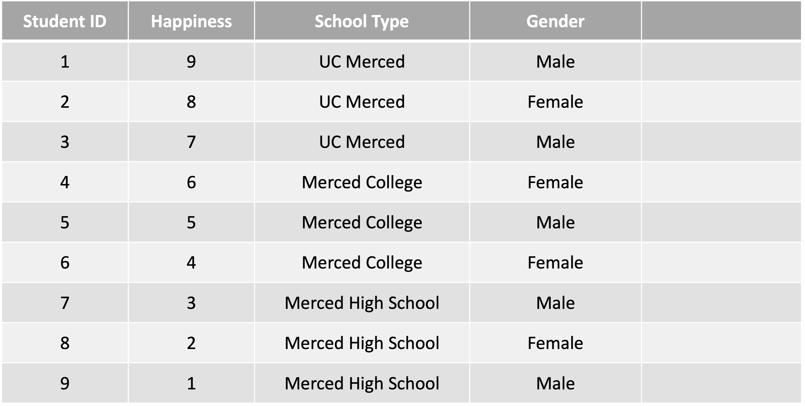
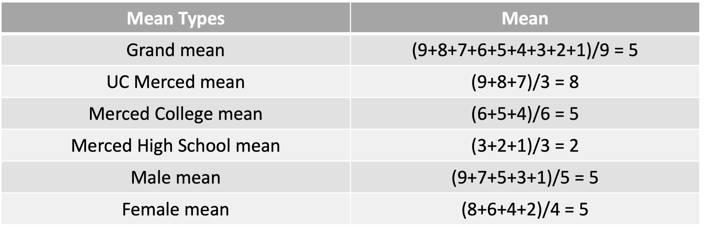
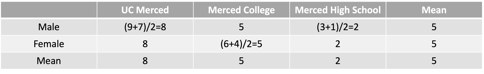
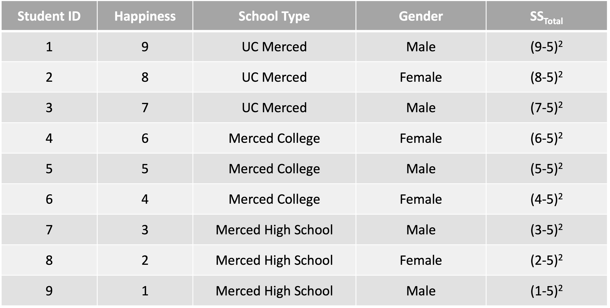
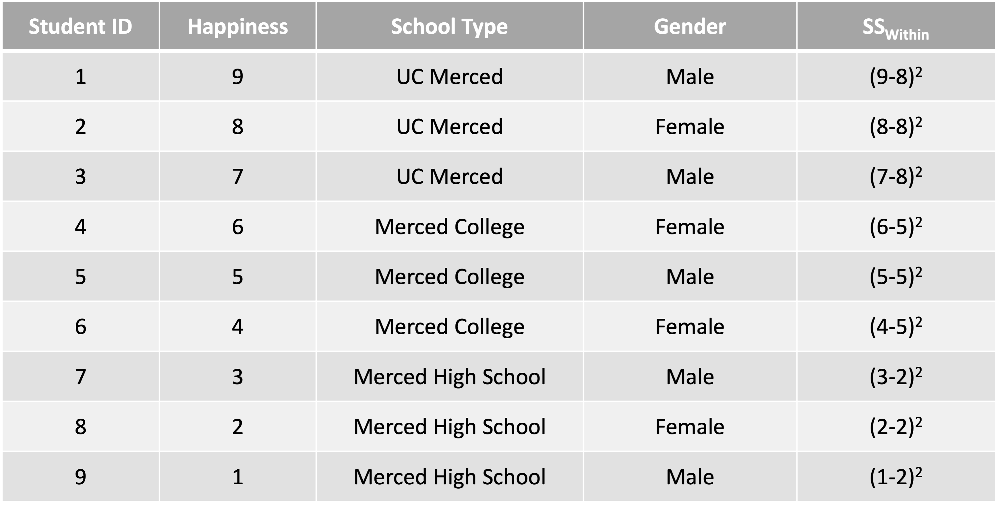
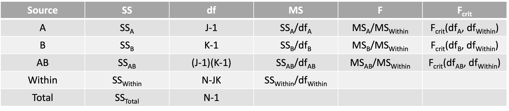
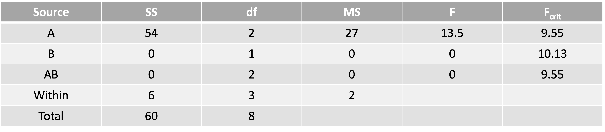

# What are we going to do?

## Recap to give you a big picture

### Factorial ANOVA

## Do it together

---

# Are you ready?

## z-test, t-test, ANOVA, ANCOVA, MANOVA, MANCOVA, RM-ANCOVA... WHAT?!

### Playing the game of statistical inference about population 'means'

---

# ANOVA Terminology

## N-way ANOVA (# of factors)

### There are N independent variables (IVs = factors = grouping variables = categorical variables)

### N = 1 $\rightarrow$ One-way ANOVA = ANOVA with 1 IV

### N = 2 $\rightarrow$ Two-way ANOVA = ANOVA with 2 IVs

### N = 2 or more $\rightarrow$ Factorial ANOVA $\rightarrow$ Start to consider interactions

---

# ANOVA Terminology

## A $\times$ B $\times$ C $\times$ ... $\times$ D ANOVA (# of levels)

### 4 $\times$ 4 $\times$ 4 ANOVA = ANOVA with 3 IVs, each with 4 levels

### 3 $\times$ 5 ANOVA = ANOVA with 2 IVs, one with 3 levels and the other with 5 levels

### 4 $\times$ 2 $\times$ 5 ANOVA = ?

---

# Factorial ANOVA Hypothesis

## Two-way ANOVA   $\rightarrow$ null hypothesis $H_0$: Nothing is going on. No effect (no difference)!

### $H_0$: IV1 does not have a significant effect on DV   = Group means on DV across levels in IV1 are not different

### $H_0$: IV2 does not have a significant effect on DV   = Group means on DV across levels in IV2 are not different

### $H_0$: Interaction between IV1 and IV2 does not have a significant effect on DV

---

# Factorial ANOVA Hypothesis

## Two-way ANOVA   $\rightarrow$ alternative hypothesis $H_1$: Something is going on. There is an effect!

### $H_1$: IV1 has a significant effect on DV   = Group means on DV across levels in IV1 are different

### $H_1$: IV2 has a significant effect on DV   = Group means on DV across levels in IV2 are different

### $H_1$: Interaction between IV1 and IV2 has a significant effect on DV

---

# Steps for ANOVA Hypothesis Testing

### 1. State the null and alternative hypotheses
### 2. Choose your $\alpha$ level
### 3. Determine the df
### 4. Locate the critical F value and state the decision rule
### 5. Calculate the ANOVA table
### 6. Compare observed and critical F values
### 7. Make a statistical decision

---

# Do it together

## Ihnwhi, Kelsie, Caleb, Natalie, and MJ form a world-class quantitative psychology research team. They collected happiness data from students in Merced. They are interested in whether school type (UC Merced, Merced College, and Merced High School) and gender (male and female) affect the students' happiness. They collected 9 students.

### Which statistical analysis should be performed?

### What are IV and DV?

### What are $H_0$ and $H_1$?

---

# Do it together

---

# Do it together

### Calculated grand mean and group means

---

# Do it together

### Calculated additional group means and made a mean table

---

# Do it together

---

# Do it together

---

# Do it together

---

# Do it together

---

# Do it together

### Instead of calculating $SS_{AB}$, we use...

### $SS_{Total}=SS_A+SS_B+SS_{AB}+SS_{Within}$ In addition to this, also...

### $df_{Total}=df_A+df_B+df_{AB}+df_{Within}$

---

# Do it together

### Do you remember how to find the critical F-ratio in the F-table? :)

---

# Do it together

## Hypothesis

### $H_0$: School type does not have a significant effect on happiness   = Group means on happiness across UC Merced, Merced College, and Merced High School are not different $\rightarrow$ Reject!

### $H_0$: Gender does not have a significant effect on happiness   = Group means on happiness across males and females are not different $\rightarrow$ Fail to reject

### $H_0$: Interaction between school type and gender does not have a significant effect on happiness $\rightarrow$ Fail to reject

---

# Do it together

## Effect size for factorial ANOVA: Partial eta-squared $\eta^2_{p}$

### $\Large \eta^2_{pA} = \frac{SS_A}{SS_A+SS_{Within}}$

### $\Large \eta^2_{pB} = \frac{SS_B}{SS_B+SS_{Within}}$

### $\Large \eta^2_{pAB} = \frac{SS_{AB}}{SS_{AB}+SS_{Within}}$

---

# Do it together

### For example,   $\eta^2_{pA} = \frac{SS_A}{SS_A+SS_{Within}} = \frac{54}{54+6} = \frac{54}{60} = .90$

### School type accounts for 90% of the between-subjects variance in the happiness

---

# Before you go home...

## Any questions or comments?

---

# Have a nice weekend!

