# What are we going to do?

## Recap to give you a big picture

### Main effect

### Interaction effect

## Do it together

---

# Factorial ANOVA

## Big idea

### Goal is to compare the means of the dependent variables across different categories of the independent variables

---

# Factorial ANOVA

## N-way (or N-factor) ANOVA (# of factors)

### There are N independent variables (IVs = factors = grouping variables)

### N = 1 $\rightarrow$ One-way ANOVA = ANOVA with 1 IV   $\rightarrow$ One hypothesis

### N = 2 or more $\rightarrow$ Factorial ANOVA $\rightarrow$ Start to consider interactions   $\rightarrow$ Multiple hypotheses

---

# Factorial ANOVA

## Two-way ANOVA   $\rightarrow$ null hypothesis $H_0$: Nothing is going on. No effect (no difference)!

### $H_0$: IV1 does not have a significant effect on DV   = Group means on DV across levels in IV1 are not different

### $H_0$: IV2 does not have a significant effect on DV   = Group means on DV across levels in IV2 are not different

### $H_0$: Interaction between IV1 and IV2 does not have a significant effect on DV

---

# Factorial ANOVA

## Two-way ANOVA   $\rightarrow$ alternative hypothesis $H_1$: Something is going on. There is an effect!

### $H_1$: IV1 has a significant effect on DV   = Group means on DV across levels in IV1 are different

### $H_1$: IV2 has a significant effect on DV   = Group means on DV across levels in IV2 are different

### $H_1$: Interaction between IV1 and IV2 has a significant effect on DV

---

# Effect

## Wait... we have been using a word **effect** a lot...

### Null hypothesis (no effect), alternative hypothesis (there is an effect), effect size...

 

## Let me ask you: What is an effect in statistics?

---

# Effect

## Intuitively, effect means **'differences'** in statistics!

### Null hypothesis $\rightarrow$ no effect $\rightarrow$ no difference

### Alternative hypothesis $\rightarrow$ there is an effect $\rightarrow$ there is a difference

### Effect size $\rightarrow$ How big our differences are

---

# Effect

## Main effect and interaction effect are also about 'differences'!

### Remember, ANOVA is all about comparing means...

## Working example

### Two-way ANOVA where two factors are school type and region

### Dependent variable: Happiness

### School type (UC Merced and Merced College) & Region (California and Massachusetts)

---

# Main effect

## Mean differences across the levels of a single factor

### An effect of a single factor averaged across levels of the other factors

### Whether there are mean differences in happiness between UC Merced and Merced College  (or between California and Massachusetts)

### Differences in marginal means

## N-way ANOVA $\rightarrow$ There are N main effects

### Two-way ANOVA $\rightarrow$ Two main effects!

---

# Main effect

## Mean differences across the levels of a single factor

### An effect of a single factor averaged across levels of the other factors

### Differences in marginal means

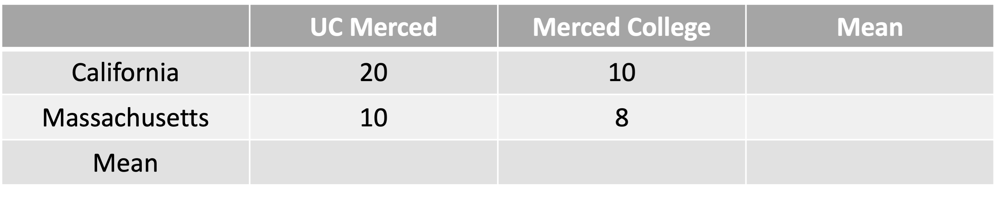

---

# Main effect

## Mean differences across the levels of a single factor

### An effect of a single factor averaged across levels of the other factors

### Differences in marginal means

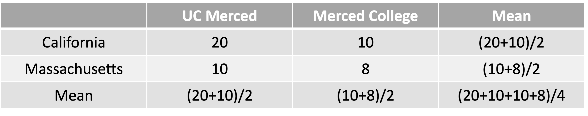

---

# Main effect

## Mean differences across the levels of a single factor

### An effect of a single factor averaged across levels of the other factors

### Differences in marginal means

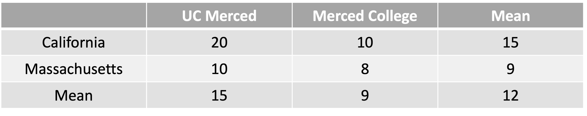

---

# Main effect

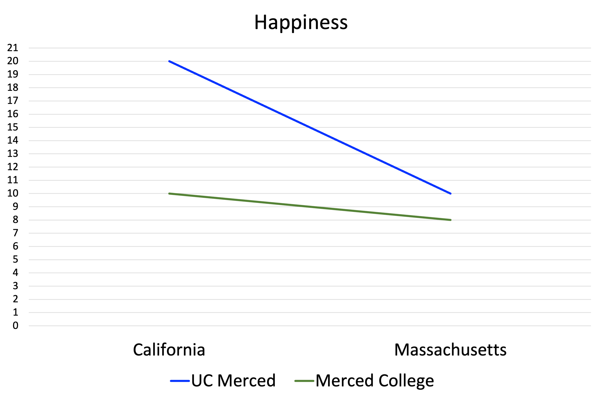

---

# Main effect

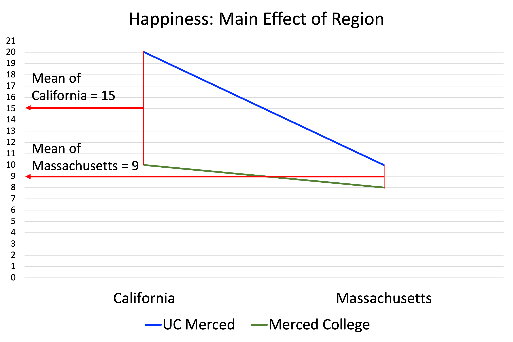

---

# Main effect

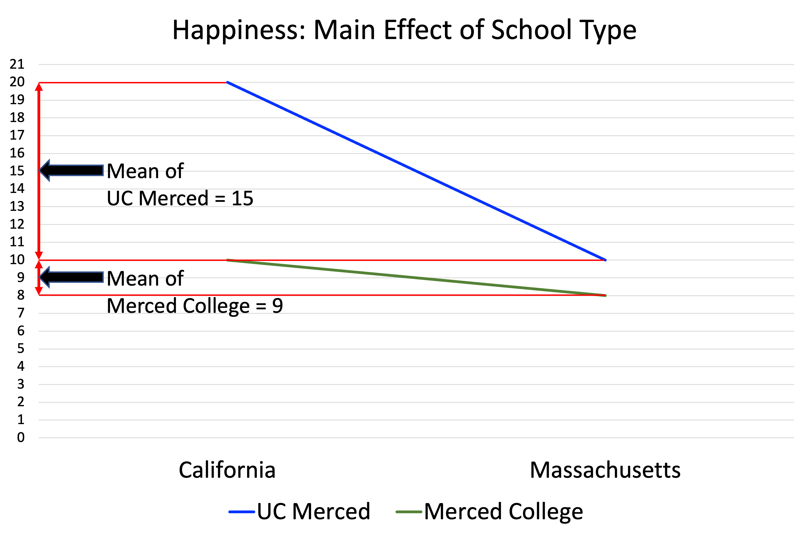

---

# Interaction effect

## If an effect of a single factor differs across levels of the other factors

### Mean differences at each level of one factor change across the levels of the other factors

### Whether the mean differences in happiness between two levels of school type (or region) change across the levels of region (or school type)

### Differences in differences $\rightarrow$ unparalleled lines

## N-way ANOVA $\rightarrow$ There are $2^N−N−1$ interaction effects

### Two-way ANOVA $\rightarrow$ One interaction effect!

---

# Interaction effect

## If an effect of a single factor differs across levels of the other factors

### Mean differences at each level of one factor change across the levels of the other factors

### Differences in differences $\rightarrow$ unparalleled lines

---

# Interaction effect

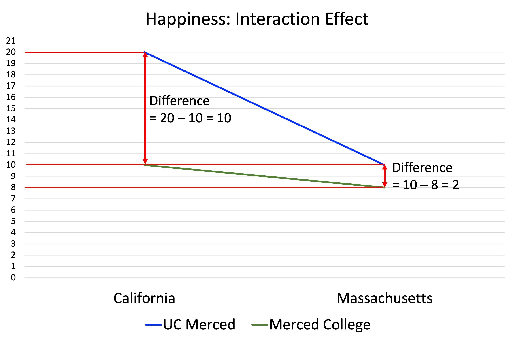

---

# Do it together (Example 1)

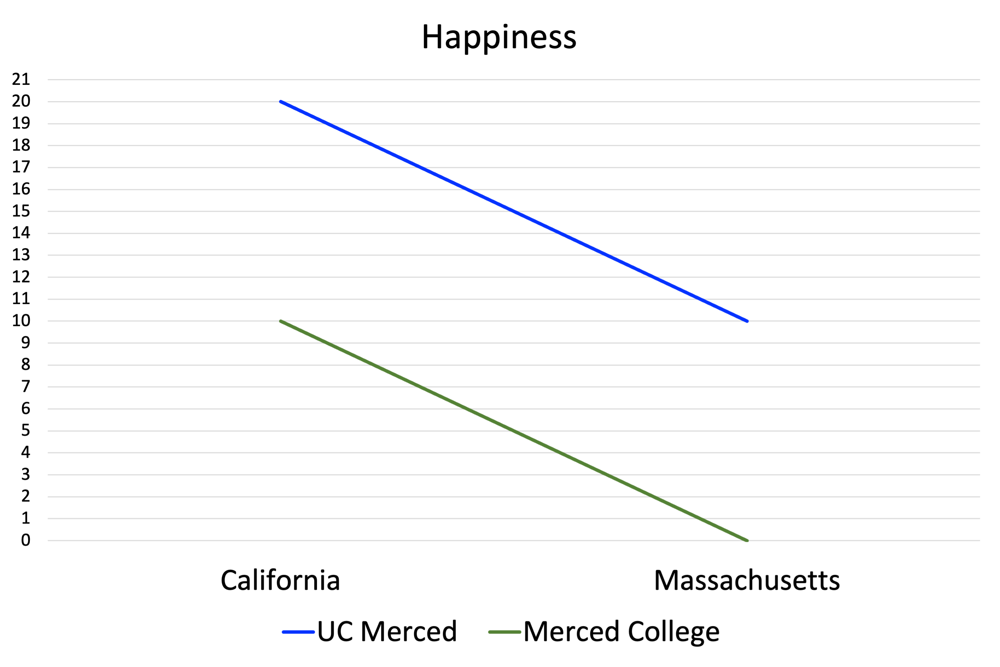

---

# Do it together (Example 2)

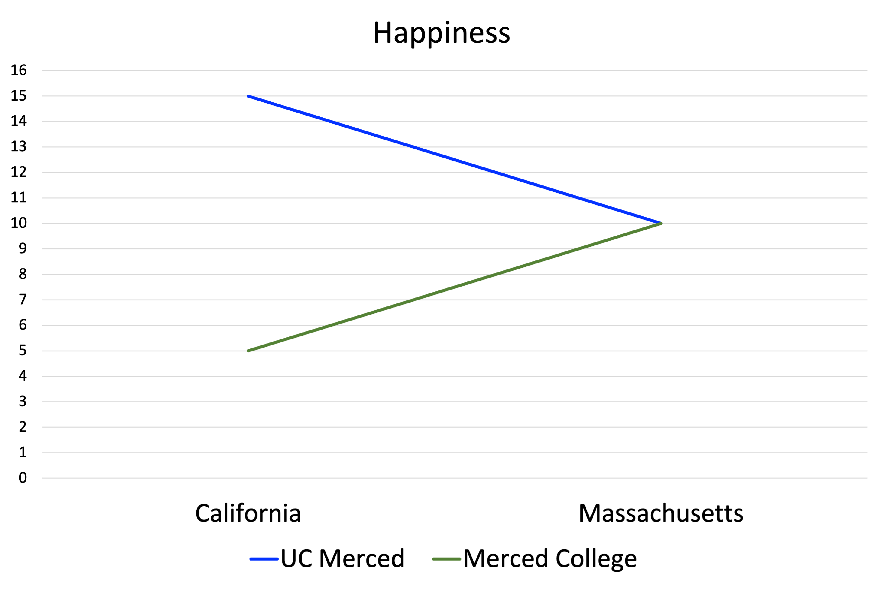

---

# Do it together (Example 3)

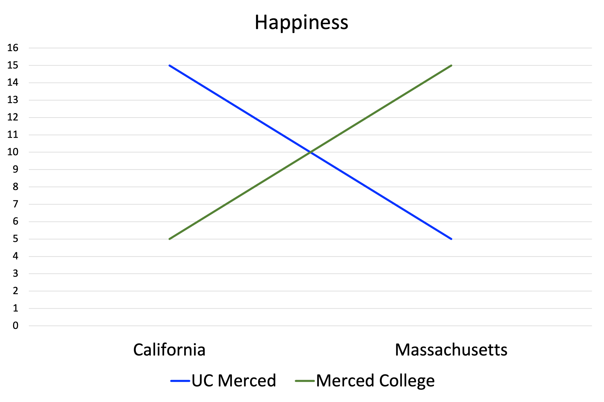

---

# Do it together (Example 4)

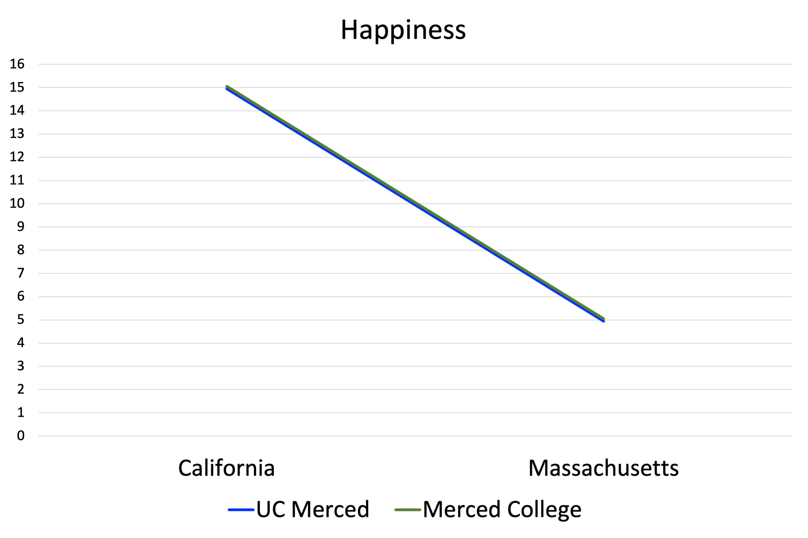

---

# Do it together

## Answer key

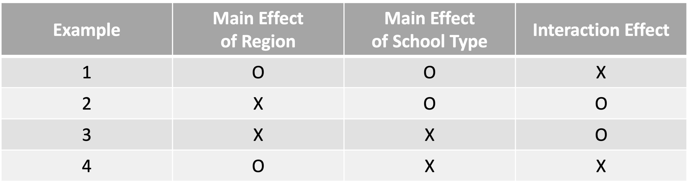

---

# Note

## Whenever we say there are whether main effect or interaction effect,   this does not necessarily mean these effects are statistically significant

## It is enough for us to suspect there might be

## To check statistical significance   $\rightarrow$ *p*-value < $\alpha$ $\rightarrow$ Observed F value > Critical F value

---

# Before you close...

## Any questions or comments?

### Shoot emails to iheo2@ucmerced.edu

---

# Have a nice weekend!

