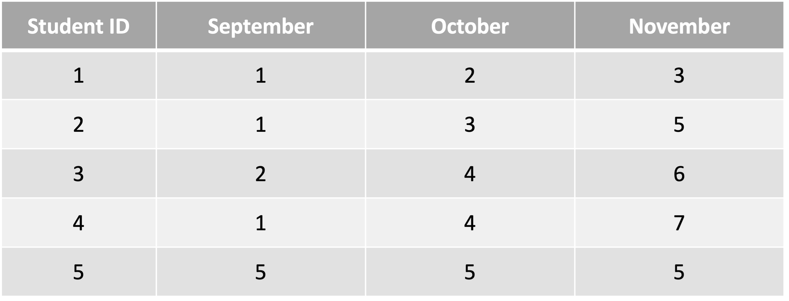
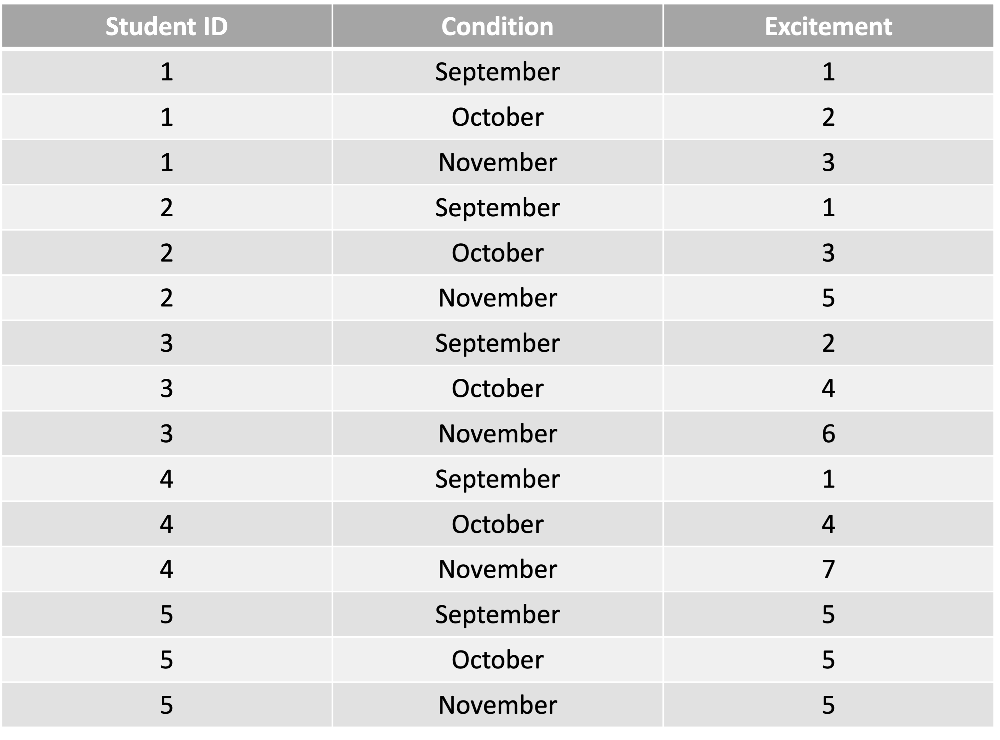
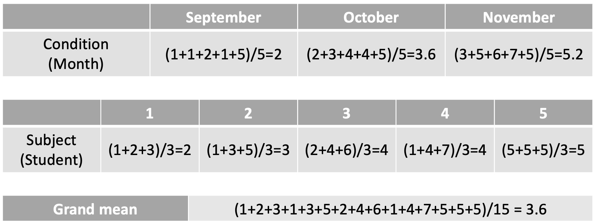
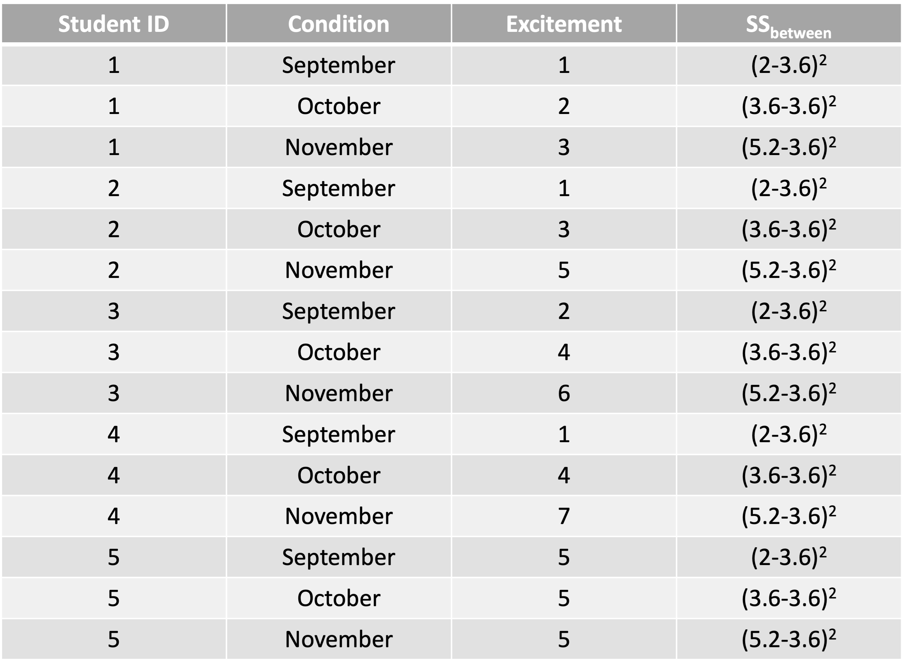
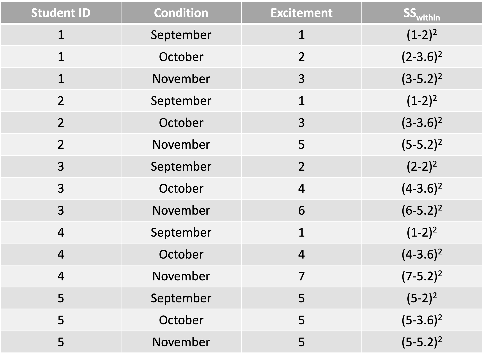
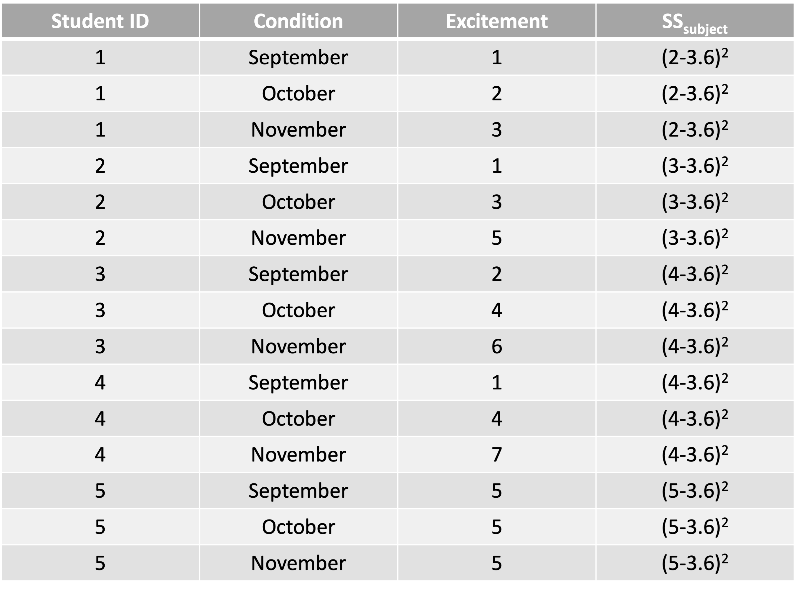
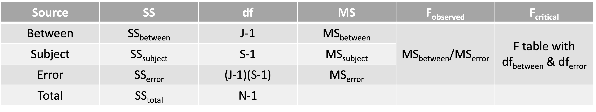
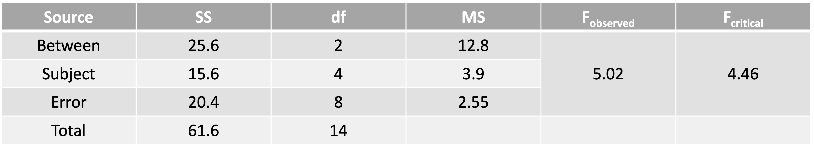
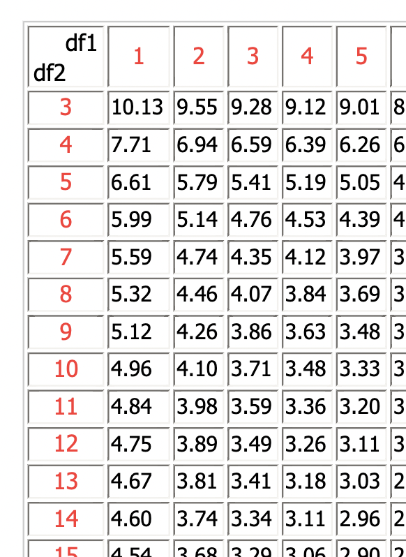
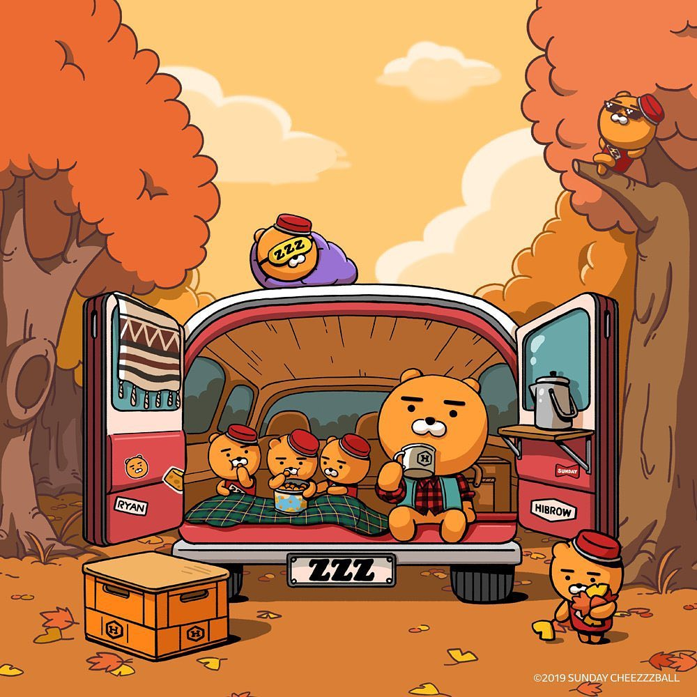

# Announcement

## Lab 11

### About main effect and interaction effect $\rightarrow$ very important!

### I will upload my recording, so please watch it!

## Supercharge assignment $\rightarrow$ refill your GPA $\rightarrow$ due November 28

## Assignment 5 (final assignment) $\rightarrow$ due December 7

## Exam 3 $\rightarrow$ You can work in pairs, so find your partner!

---

# Announcement

## We do **not** have a lab on November 26

## We have our **final** lab on December 3

### Will be about correlation and regression

### A small remark on using p-values $\rightarrow$ Do you remember a black bear story?

### Are you happy or sad that this will be our last meeting? :)

---

# What are we going to do?

## Recap to give you a big picture

### Repeated measures ANOVA

## Do it together

---

# Let's conquer ANOVA

## Big idea

### Goal is to compare the means of the dependent variables across different levels of the independent variables (*aka*. factor = grouping variable)

## A brief example

### Brandon and Michael investigate whether there are mean differences of happiness in the school type (UC Merced, Merced College, and Merced High School)

### What are DV, IV, level of IV?

---

# Let's conquer ANOVA

## N-way (or N-factor) ANOVA (# of factors)

### There are N independent variables (IVs = factors = grouping variables)

### N = 1 $\rightarrow$ One-way ANOVA = ANOVA with 1 IV

### N = 2 or more $\rightarrow$ Factorial ANOVA $\rightarrow$ Start to consider interactions

## A $\times$ B $\times$ C $\times$ ... $\times$ D ANOVA (# of levels)

### 4 $\times$ 4 $\times$ 4 ANOVA = ANOVA with 3 IVs, each with 4 levels

---

# Let's conquer ANOVA

## Between-subjects factor

### Factor separates groups of **different** individuals

### Each score comes from a different subject

## Example?

### Clinical therapy (behavioral, cognitive, control)

### Place of birth (California, Oregon, Florida, Arizona)

---

# Let's conquer ANOVA

## Within-subjects factor

### Factors separate multiple measures within the **same** individuals

### Each subject provides scores under multiple conditions/timepoints

## Example?

### Time (measurements at time 1, time 2, and time 3)

### Repeated measurements in general!

---

# Repeated measures ANOVA

## ANOVA with within-subjects factors

 

## In this course, we focus on **one-way repeated measures ANOVA**

### A research question investigates whether there are mean differences across the repeated measurements of the same individuals!

---

# Repeated measures ANOVA

### 1. State the null and alternative hypotheses
### 2. Choose $\alpha$ level (usually 0.05)
### 3. Calculate ANOVA table (finding means, SS, df, MS, and observed F value)
### 4. Determine df1 and df2
### 5. Locate critical F value
### 6. Compare the observed F value to the critical F value
### 7. (If necessary) effect size

---

# Do it together

## Shelby and Vanessa are data analysts at Marvel Studios. They are investigating how much people are looking forward to watching the upcoming Spider-Man: No Way Home across three consecutive occasions (September, October, and November). They recruited 5 students at UC Merced and let them record how excited they are to see the movie each month.

### Which statistical analysis should be performed?

### What are the null and alternative hypotheses?

---

# Do it together

## $H_0: \mu_{Sep} = \mu_{Oct} = \mu_{Nov}$   $\rightarrow$ The means of the degree of excitement are the same across the three months

## $H_1$: Not all $\mu_{Month}$ are equal   $\rightarrow$ All the means of the degree of excitement are not equal

## Let's use $\alpha$-level (i.e., significance level) of 0.05.

---

# Do it together

## From now on, we will fill in the ANOVA table

 

## Do you remember Sum of Squares (SS)?

### ANOVA $\rightarrow$ Analysis of Variance $\rightarrow$ Variance   $\rightarrow$ Sum of squares divided by the degrees of freedom $\rightarrow$ SS is important   $\rightarrow$ We separate SS into different sources $\rightarrow$ In general, separation into between and within

---

# Do it together

## Separating SS

### One-way ANOVA $\rightarrow$ $SS_{Tot.} = SS_{Bet.} + SS_{With.}$

### Two-way ANOVA $\rightarrow$ $SS_{Tot.} = SS_{F1} + SS_{F2} + SS_{Int.} + SS_{With.}$

### One-way repeated measures ANOVA $\rightarrow$ $SS_{Tot.} = SS_{Bet.} + SS_{Subj.} + SS_{Err.}$

### **REMEMBER**: $SS_{With.}=SS_{Subj.}+SS_{Err.}$ in case of one-way RM ANOVA

## Rule applies to the degrees of freedom!

---

# Do it together

### Our data

---

# Do it together

### Our data in a different way

---

# Do it together

### We need these means

---

# Do it together

### $SS_{Bet.} \rightarrow$ subtract grand mean from the mean of each level/condition $\rightarrow$ 25.6

---

# Do it together

### $SS_{With.} \rightarrow$ subtract the mean of each level/condition from individual scores $\rightarrow$ 36

---

# Do it together

### $SS_{Subj.} \rightarrow$ subtract grand mean from the mean of subjects $\rightarrow$ 15.6

---

# Do it together

### Fill in the ANOVA table
### **REMEMBER**: $SS_{With.}=SS_{Subj.}+SS_{Err.}$ in case of one-way RM ANOVA   That is, $SS_{Err.}=SS_{With.}-SS_{Subj.}$

---

# Do it together

### Fill in the ANOVA table
### **REMEMBER**: $SS_{With.}=SS_{Subj.}+SS_{Err.}$ in case of one-way RM ANOVA   That is, $SS_{Err.}=SS_{With.}-SS_{Subj.}=36-15.6=20.4$

---

# Do it together

### F-table associed with df1 of 2 and df2 of 8

---

# Do it together

### Decision: reject or fail to reject the null hypothesis? $\rightarrow F_{observed} > F_{critical}$ 

### $H_0: \mu_{Sep} = \mu_{Oct} = \mu_{Nov}$   $\rightarrow$ The means of the degree of excitement are the same across the three months   $\rightarrow$ Reject $H_0$

---

# Do it together

## Effect size for repeated measures ANOVA: Partial eta-squared $\eta^2_{partial}$

### $\Large \eta^2_{partial} = \frac{SS_{Bet.}}{SS_{Bet.}+SS_{Err.}}$

---

# Do it together

## Effect size for repeated measures ANOVA: Partial eta-squared $\eta^2_{partial}$

### $\eta^2_{partial} = \frac{SS_{Bet.}}{SS_{Bet.}+SS_{Err.}} = \frac{25.6}{25.6+20.4}=\frac{25.6}{46}=0.56$

### Interpretation: Months explain 56% of the variance in excitement

---

# Before you go home...

## Any questions or comments?

---

# Happy Thanksgiving!!!

