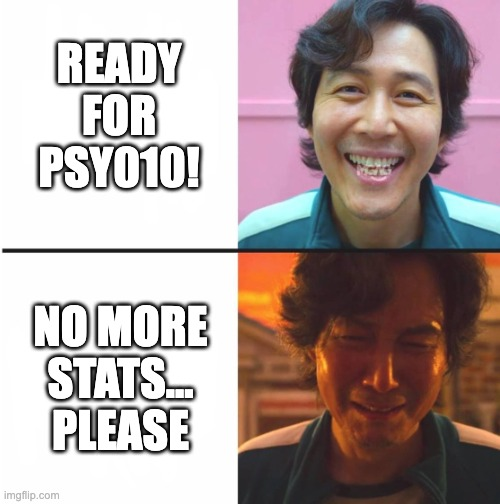

# Announcement

## Assignment 5 is due December 7 (next Tuesday)

## Exam 3 is on December 9 (next Thursday)

### Prepare for the correct scantron form (see next slide) $\rightarrow$ Otherwise, you get a score of 0

### Work individually or in pairs

### Bring pencil, eraser, pen, calculator, notes, F-table, correlation table

---

# Announcement

## Scantron form (red and large one)

<center>

</center>

---

# What are we going to do?

## Recap to give you a big picture

### Correlation

### Regression

### ... and Metascience

## Do it together

---

# It's been a long, long semester

<center>

</center>

---

# It's been a long, long semester

## What you've learned...

### Fundamentals (design, measurement, analysis), different research designs (experimental, quasi-experimental, correlational), descriptive vs. inferential statistics, measurement scale (nominal, ordinal, interval, ratio), data visualization (bar chart, pie chart, histogram, scatterplot), central tendency (mean, median, mode), variability (range, variance, standard deviation), population parameters vs. sample statistics, normal distribution, z-score, central limit theorem, standard error, (frequentist) null hypothesis significance testing, significance level, p-value, z-test, test-statistic, effect size (Cohen's d, eta-squared, partial eta-squared), z-table, t-test (one-sample, independent-sample, related-sample), t-table, type I and type II error, power, one-way ANOVA (sum of squares, mean square, F-value), F-table, factorial ANOVA, repeated measures ANOVA, correlation, correlation table, regression

---

# Correlation

.pull-left[
## Do you remember scatterplot?

### Shows how two variables are related

```{r sca1, eval=FALSE}
plot(mtcars$wt, mtcars$mpg,
   main="Scatterplot Example",
   xlab="Car Weight ",
   ylab="Miles Per Gallon ", pch=19)
```
]

.pull-right[
```{r, ref.label="sca1", echo=FALSE}
```
]

---

# Correlation

## Goal

### To describe a relationship between two variables (i.e., how two variables are related)

## Real-life examples

### The longer time you drive, the more gasoline your will need

### The taller the person is, the heavier the person is

---

# Correlation

## Does not mean causation

<center>

</center>

---

# Correlation

## Two key ideas

### Direction $\rightarrow$ positive vs. negative

### Strength $\rightarrow$ perfect vs. strong vs. weak vs. no

## Need to know how to interpret

### Scatterplot

### Correlation coefficient

---

# Correlation

## Direction

### Positive $\rightarrow$ As one variable increases, the other increases

### Negative $\rightarrow$ As one variable increases, the other decreases

## Strength

### How much two variables covary $\rightarrow$ Degree to which the data fall on a straight line

---

# Correlation

## Scatterplot

### One variable is on the x-axis whereas the other variable is on the y-axis

## Correlation coefficient

### Correlation coefficient ragnes from -1 (perfect negative) to 1 (perfect positive)

### Mathematically, correlation is a standardized covariance $\rightarrow$ We'll do it together

---

# Correlation

## Direction and strength

<center>

</center>

---

# Correlation

## Pearson's correlation coefficient $\leftarrow$ standardized covariance

### A statistic that describes the direction and the strength of the linear relationship

$\LARGE r_{XY} = \frac{Cov_{XY}}{s_Xs_Y} = \frac{SS_{XY}}{\sqrt{SS_XSS_Y}}$

### $SS_{XY}$ is the sum of products of deviations for two variables X and Y
### $SS_{X}$ is the sum of squares for one variable X
### $SS_{Y}$ is the sum of squares for the other variable Y

---

# Do it together - Correlation

## Adrian, Alejandro, Amy, and Roberto are data scientists at Instagram. They want to investigate whether the length of time spent on Instagram is correlated with satisfaction with the app. They collect a sample of 5 Instagram users. Each user reported length of time on the app per week and satisfaction with the app on a 1-5 scale (1 = not satisfied, 5 = very satisfied).

## Test whether Pearson's correlation coefficient is significant for this dataset.

---

# Do it together - Correlation

### 1. State the null and alternative hypothesis

### 2. Choose your $\alpha$-level of significance

### 3. Determine the degrees of freedom

### 4. Locate the critical r value

### 5. Calculate Pearson's r

### 6. Compare observed and critical r value $\rightarrow$ Reject the null hypothesis if the absolute value of the observed r value is greater than the absolute value of the critical r value

---

# Do it together - Correlation

## State hypotheses

### $H_0:\:r=0$ <br>The population correlation coefficient between time and satisfaction is zero.

### $H_1:\:r\neq0$ <br>The population correlation coefficient between time and satisfaction is different from zero.

## Choose your $\alpha$-level of significance

### Let's use two-tailed test with the $\alpha$-level of 0.05

---

# Do it together - Correlation

## Determine the degrees of freedom

### $df=n-2$ where $n$ refers to the sample size

## In our example...

### $df=n-2=5-2=3$

---

# Do it together - Correlation

## Locate the critical r value, which is 0.878

<center>

</center>

---

# Do it together - Correlation

## Pearson's correlation coefficient $\leftarrow$ standardized covariance

### Formula is as follows:

$\LARGE r_{XY} = \frac{Cov_{XY}}{s_Xs_Y} = \frac{SS_{XY}}{\sqrt{SS_XSS_Y}}$

### $SS_{XY}$ is the sum of products of deviations for two variables X and Y
### $SS_{X}$ is the sum of squares for one variable X
### $SS_{Y}$ is the sum of squares for the other variable Y

---

# Do it together - Correlation

## Data in a table

<center>

</center>

---

# Do it together - Correlation

.pull-left[
## Scatterplot of the Instagram example

```{r sca2, eval=FALSE}
insta.time <- c(18,8,4,16,10)
insta.satis <- c(5,3,1,4,2)
insta.dat <- data.frame(insta.time, insta.satis)

plot(insta.dat$insta.time, insta.dat$insta.satis,
   main="Relationship between hours spent
   on Instagram and satisfaction",
   xlab="Hours spent on Instagram",
   ylab="Satisfaction with Instagram App", pch=19)
```
]

.pull-right[
```{r, ref.label="sca2", echo=FALSE}
```
]

---

# Do it together - Correlation

## Calculation

<center>

</center>

---

# Do it together - Correlation

## Correlation coefficient

$\LARGE r_{XY} = \frac{Cov_{XY}}{s_Xs_Y} = \frac{SS_{XY}}{\sqrt{SS_XSS_Y}} = \frac{34}{\sqrt{132.8 \times 10}}=0.933$

## What does this correlation coefficient signal to us?

### Direction: Positive

### Strength: Strong

---

# Do it together - Correlation

## Make a decision

### $r_{obt} = 0.933$

### $r_{crit} = 0.878$

### Reject $H_0$ if p-value < $\alpha$ <br> $\Longleftrightarrow$ $|r_{obt}| > |r_{crit}|$ $\Longleftrightarrow$ $|0.933| > |0.878|$ $\Longleftrightarrow$ $0.933 > 0.878$

### In our example, the null hypothesis is rejected. The conclusion is that there is a significant positive correlation between time spent on the Instagram app and satisfaction with the app (i.e., correlation is not 0, there is an effect).

---

# Do it together - Correlation

## Effect size $\rightarrow$ Coefficient of determination $r^2$

### $r^2 = 0.933^2 = 0.87049$

## Interpretation

### The length of time spent on the Instagram app accounted for 87.05% of the variance in the user's satisfaction with the Instagram app

### You can also say in the other way around $\rightarrow$ User's satisfaction with the Instagram app accounts for 87.05% of the variance in the length of time spent on the Instagram app

---

# Regression

## Goal

### To predict values of the dependent variable (Y) from values of the independent variable (X)

## Real-life examples

### If you drive 5 hours, how many gallons of gasoline you will need

### If the person is 6 feet, how heavy the person would be

---

# Regression

## Regression equation

### $\hat{Y}_i = b + mX_i$

### $\hat{Y}_i$ is a value of Y on the regression line for individual i $\rightarrow$ predicted value of Y <br> $X_i$ is an individual i's value on the independent variable

### $b$ is an intercept $\rightarrow$ a value of $Y$ when $X$ is 0 <br> $m$ is a slope $\rightarrow$ rate of change in $Y$ when $X$ changes by one-unit

### Regression equation about $\hat{Y}_i$ is also referred to as a prediction line

---

# Regression

## Regression equation

### ${Y}_i = b + mX_i + e_i$

### $Y_i$ is an individual i's value on the dependent variable $\rightarrow$ observed value of Y <br> $X_i$ is an individual i's value on the independent variable

### $b$ is an intercept $\rightarrow$ a value of $Y$ when $X$ is 0 <br> $m$ is a slope $\rightarrow$ rate of change in $Y$ when $X$ changes by one-unit

### $e_i$ an error (a residual) for individual i $\Longleftrightarrow$ $e_i = Y_i - \hat{Y}_i$

---

# Regression

## Slope $\rightarrow$ $m$

### $\hat{Y}_i = b + mX_i$

### Rate of change in $Y$ when $X$ changes by one-unit

### $m = \frac{SS_{XY}}{SS_X} = \frac{\Sigma_{i=1}^{N}(X_i-\bar{X})(Y_i-\bar{Y})}{\Sigma_{i=1}^{N}(X_i-\bar{X})^2}$

### $SS_{XY}$ is the sum of products of deviations for two variables X and Y <br> $SS_{X}$ is the sum of squares for one variable X

---

# Regression

## Intercept $\rightarrow$ $b$

### $\hat{Y}_i = b + mX_i$

### A value of $Y$ when $X$ is 0

### After you calculate the slope, input $\bar{X}$ to $X_{i}$ and $\bar{Y}$ to $\hat{Y}_{i}$ to obtain the intercept

---

# Do it together - Regression

## Blanca, Carly, Karla, Bianca, and Anthoni, another team of data scientists at Instagram, wants to investigate if hours spent on Instagram predicts satisfaction with the Instagram app. They use the same data collected for correlation analysis.

## In this case...

### Dependent variable (Y): satisfaction

### Independent variable (X): Hours

---

# Do it together - Regression

## Several values we obtained before

<center>

</center>

---

# Do it together - Regression

## Regression equation

$\hat{Y}_i = b + mX_i$

## Slope

$m = \frac{SS_{XY}}{SS_X} = \frac{\Sigma_{i=1}^{N}(X_i-\bar{X})(Y_i-\bar{Y})}{\Sigma_{i=1}^{N}(X_i-\bar{X})^2} = \frac{34}{132.8} = 0.26 \rightarrow \hat{Y}_i = b + 0.256X_i$

## Intercept

Input $\bar{X}$ to $X_{i}$ and $\bar{Y}$ to $\hat{Y}_{i}$ $\rightarrow 3 = b + 0.256 \times 11.2 \rightarrow b = 3 - 0.256 \times 11.2 = 0.133$ 

---

# Do it together - Regression

## Regression equation

### $\hat{Y}_i = 0.133 + 0.256X_i$

## Interpretation

### Slope of 0.256 $\rightarrow$ 1-hour increase in using the Instagram app leads to 0.256 point increase in satisfaction

### Intercept of 0.133 $\rightarrow$ When the independent variable (i.e., hours) is 0, the dependent variable (i.e., satisfaction) is 0.133

---

# Do it together - Regression

## Regression equation

### $\hat{Y}_i = 0.133 + 0.256X_i$

## Let's do prediction

### If the user uses 10 hours, what would be a satisfaction score? Input 10 to X

$\hat{Y}_i = 0.133 + 0.256X_i = 0.133 + 0.256 \times 10 = 0.133 + 2.56 = 2.693$ 

### Satisfaction score would be 2.693

---

# Regression

## Other measures you can compute (FYI; details are on lecture slides)

### Correlation coefficient between the dependent variable and the independent variable

### $r_{XY} = \frac{SS_{XY}}{\sqrt{SS_X SS_Y}}$

### Coefficient of determination $\rightarrow$ Proportion of variance in Y explained by X

### $r_{XY}^2 = (r_{XY})^2 = r_{XY} \times r_{XY}$

---

# Regression

## Other measures you can compute (FYI; details are on lecture slides)

### Sum of squares in the DV explained by IV

### $r^2 SS_Y = r^2 \times SS_Y$

### Sum of squares in the DV NOT explained by IV

### $(1-r^2) SS_Y = (1-r^2) \times SS_Y$

---

# Regression

## Other measures you can compute (FYI; details are on lecture slides)

### We can use ANOVA to examine if IV predicts DV well

### F-value $\rightarrow$ test statistics

### $F = \frac{MS_{regression}}{MS_{residual}} = \frac{\frac{SS_{regression}}{df_{regression}}}{\frac{SS_{residual}}{df_{residual}}} = \frac{\frac{r^2 SS_Y}{1}}{\frac{(1-r^2) SS_Y}{N-2}}$

### where $N$ is the sample size

---

# Regression

## Other measures you can compute (FYI; details are on lecture slides)

### Standard error

### Standard deviation or distance that data points in a sample fall from the regression line

### $S_{e} = \sqrt{MS_{residual}} = \frac{SS_{residual}}{df_{residual}} = \frac{(1-r^2)SS_Y}{N-2}$

### where $N$ is the sample size

---

# Metascience

## Recall that I kept emphasizing the problems of p-values... but why?

---

# Metascience

## The replication crisis in psychology

### Only 36% of the significant findings (p-value below 0.05) was replicable

<center>

</center>

---

# Metascience

## One of the problems pointed out was the p-value

<center>

</center>

---

# Metascience

## A movement to redefine or ban the p-value

<center>

</center>

---

# Metascience

## Stop using p-values!

### Prof. Dr. Rens van de Schoot (https://www.youtube.com/watch?v=owb5A8lVS0o)

<center>

</center>

---

# Metascience

## Open Science Movement

<center>

</center>

---

# Concluding remark

## What I want to convey to you...

### Be critical in doing everything in your life

### Be transparent in doing science

### Enjoy your undergraduate life (jealous of you!)

---

# Before we finish our semester...

## Any **FINAL** questions or comments?

<center>

</center>

---

# Thank you for the great semester! Cheers!

<center>

</center>
