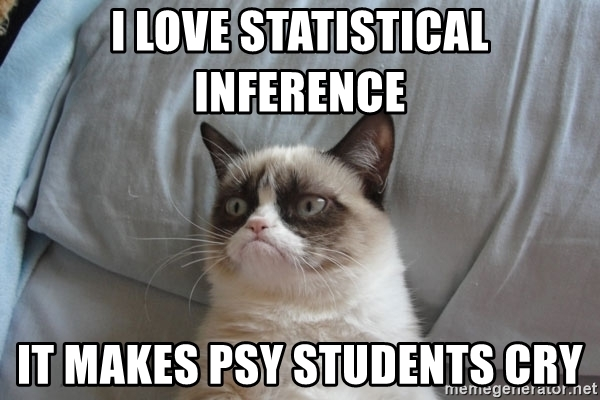

# What are we going to do?

## Recap to give you a big picture

### Probability

### Central limit theorem

## Group activity

---

# Prelude

## For those who start inferential statistics (*a.k.a.* statistical inference)

### Logic is crucial, so do not hesitate to ask me questions if anything is unclear!

### Let's prove ourselves against this grumpy cat!

<center>

</center>

---

# Prelude

## We now do inferential statistics

### Statistical inference

Idea 1: Let's make a best guess and test if that guess is true $\rightarrow$ Estimation (point and interval) and hypothesis testing

Idea 2: Let's assume we have one sample statistic of interest (e.g., sample mean) and the distribution of all the possible sample statistics $\rightarrow$ Central limit theorem, sampling distribution, sampling error, and standard error

### Statement of probability

We speak of statistical inference in the statement of probability
</br>
(e.g., Hypothesis testing: what is the probability of obtaining a result that is as extreme as the one we have observed, if the hypothesis were true? $\rightarrow$ *p*-value)

---

# Probability

## Tells us how likely something is to happen
$\LARGE P(X)=\frac{\#\;of\;ways\;that\;X\;can\;occur}{Total\;\#\;of\;possible\;outcomes}$

### When you flip a coin, what is the probability of the head (or the front side)?

### What if you saw three heads in a row during the first three tosses?
  
---

# Probability

## The law of large numbers

Probability is about after a large number of times

As the number of trials (infinitely) increases, the average outcome converges to the expected probability (~~frequentist statistics~~)

## Why important to take this into account?

Helpful to understand the precise idea of some terms (e.g., confidence interval)

---

# Central limit theorem

## Why important?

We can apply probabilistic and statistical methods **that work for normal distributions** to problems involving other types of distributions

## Characteristics

1. The distribution of sample means (aka. sampling distribution) will have less spread than the original population distribution
2. No matter what the original distribution looks like, the sampling distribution approximates a normal distribution if the sample sizes are larger enough
3. Bigger sample sizes lead to a smaller spread of the sampling distribution

### Code from https://www.analyticsvidhya.com/blog/2019/05/statistics-101-introduction-central-limit-theorem/

---

# Central limit theorem

.pull-left[
## Your population is distributed as
```{r pop, eval=FALSE}
set.seed(322) # Replicability
dat <- rbeta(10000, 3, 25) # Data simulation
hist(dat, col ="lightblue", main="Population distribution", xlab = "Simulated data") # Plot a histogranm
```

## The population mean is 0.107.
]

.pull-right[
```{r, ref.label="pop", echo=FALSE}
```
]

---

# Central limit theorem

.pull-left[
## Collect a sample of 20 values, calculate the mean, and plot it... We repeat this 10000 times
```{r sam30, eval=FALSE}
set.seed(20210923) # Replicability
sample.20 <- c() # Empty vector
n=10000 # The number of iterations
for (i in 1:n) {
  sample.20[i] = mean(sample(dat,20, replace = TRUE))}
hist(sample.20, col ="lightblue", main="Sample size = 20",xlab = "Simulated data", xlim=c(0.07, 0.17))
abline(v = mean(sample.20), col = "Red")
```

## The mean is 0.107.
]

.pull-right[
```{r, ref.label="sam30", echo=FALSE}
```
]

---

# Central limit theorem

.pull-left[
## Collect a sample of 50 values, calculate the mean, and plot it... We repeat this 10000 times
```{r sam50, eval=FALSE}
set.seed(20210923) # Replicability
sample.50 <- c() # Empty vector
n=10000 # The number of iterations
for (i in 1:n) {
  sample.50[i] = mean(sample(dat,50, replace = TRUE))}
hist(sample.50, col ="lightblue", main="Sample size = 50",xlab = "Simulated data", xlim=c(0.07, 0.17))
abline(v = mean(sample.50), col = "Red")
```

## The mean is 0.107.
]

.pull-right[
```{r, ref.label="sam50", echo=FALSE}
```
]

---

# Central limit theorem

.pull-left[
## Collect a sample of 500 values, calculate the mean, and plot it... We repeat this 10000 times
```{r sam500, eval=FALSE}
set.seed(20210923) # Replicability
sample.500 <- c() # Empty vector
n=10000 # The number of iterations
for (i in 1:n) {
  sample.500[i] = mean(sample(dat,500, replace = TRUE))}
hist(sample.500, col ="lightblue", main="Sample size = 500",xlab = "Simulated data", xlim=c(0.07, 0.17))
abline(v = mean(sample.500), col = "Red")
```

## The mean is 0.107.
]

.pull-right[
```{r, ref.label="sam500", echo=FALSE}
```
]

---

# Sampling distribution of the mean

## What is it?

### Distribution of the sample means (i,e., collection of the means of the possible samples)

## What can we do?

### Calculate the probability of getting any specific mean from a random sample

### Use the z-table since the sampling distribution is normally distributed

---

# Sampling distribution of the mean

## Sampling error

Deviation of the (each) sample mean from the population mean

$\huge \bar{X}-\mu_{X}$

## Standard error of the mean

Standard deviation of the sampling distribution of the mean (spread of sampling error)

Typical distance that a sample mean deviates from the population mean

$\huge s_{\bar{X}}=\frac{s_{X}}{\sqrt{n}}$

---

# Estimation

## In an easy word

### Making a BEST guess about the population parameter to do hypothesis testing

## Two common forms

### Point estimation and interval estimation

---

# Estimation

## Point estimation

### One sample statistic to represent the population is called a point estimate

### Example: the mean of a sample

## Interval estimation

### A range that adds uncertainties around a point estimate

### Example: 90% confidence interval, 95% confidence interval, 99% confidence interval

---

# Estimation

## Point estimation

$\bar{X}$

## Interval estimation

90% confidence interval = $\bar{X}\pm1.645\times\frac{s_{X}}{\sqrt{n}} = [\bar{X}-1.645\times\frac{s_{X}}{\sqrt{n}},\;\bar{X}+1.645\times\frac{s_{X}}{\sqrt{n}}]$

95% confidence interval = $\bar{X}\pm1.96\times\frac{s_{X}}{\sqrt{n}} = [\bar{X}-1.96\times\frac{s_{X}}{\sqrt{n}},\;\bar{X}+1.96\times\frac{s_{X}}{\sqrt{n}}]$

99% confidence interval = $\bar{X}\pm2.575\times\frac{s_{X}}{\sqrt{n}} = [\bar{X}-2.575\times\frac{s_{X}}{\sqrt{n}},\;\bar{X}+2.575\times\frac{s_{X}}{\sqrt{n}}]$

---

# Group activity

## Case

Noelia, a chief psychometrician at Educational Testing Service, is responsible for analyzing SAT scores. She selected a sample data set of 400 students from the population. According to the preliminary analyses, the population has a mean of 1000 and a standard deviation of 200.

## Can you answer below?
- What is the typical distance that a sample mean of SAT scores deviates from the population mean?
- What is the probability that the one sample of 400 students randomly drawn has a mean SAT score of 1010 or higher?
- If Noelia calculates the 95% confidence interval of the mean, what would be?
- Say Joel, a statistician in the U.S. Department of Education, visited Noelia and received a sample of 625 students to do some research.
  - Between Noelia and Joel, who do you think will have a sampling distribution of the mean that is less dispersed? Why?

---

# Before you go home...

## Any questions or comments?

---

# Cheers! Good luck!

<center>

</center>
