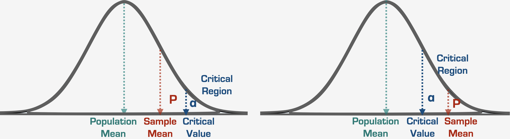
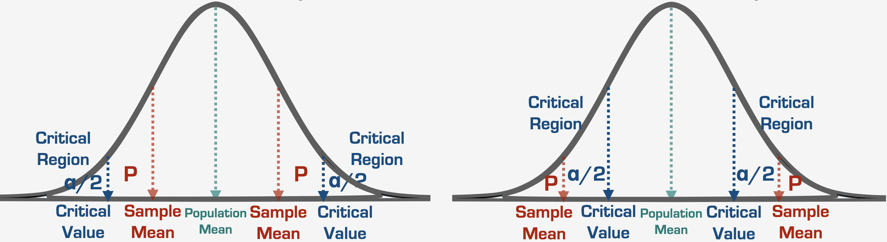

# Thanks, Siv!

## Who is responsible for lab contents?

### Ihnwhi: Lab 1 ~ 4

### Sivenesi: Lab 5 ~ 8

### Mahdi: Lab 9 ~ 12

### Each TA: Lab 13

---

# Reminders

## Homework 3 is due October 14 (50 points)

## Homework 4 is due October 21 (7 points)

## The semester is getting busy. Plan ahead to avoid getting overwhelmed!

## Be kind to **yourself**!

---

# What are we going to do?

## Recap to give you a big picture

### Hypothesis testing

## Group activity

---

# Statistical inference

## Idea 1

### Let's make a best guess about the population parameter and test if that guess is true  $\rightarrow$ Estimation and hypothesis testing

## Idea 2

### Let's assume we are interested in one sample statistic (e.g., a sample mean) and have the distribution of all the possible sample statistics  $\rightarrow$ Sampling distribution

---

# Hypothesis testing

## In a nutshell

### A form of statistical inference to draw conclusions about population parameters using sample statistics

### How science is conducted and advanced

### One of Ihnwhi's research interests is Bayesian hypothesis testing

### But... we learn frequentist hypothesis testing, *a.k.a.*, **NHST** :)

---

# Hypothesis testing

## From now on, let me show you a general procedure

### Set research questions

### State null and alternative hypothesis

### Select the level of significance, i.e., $\alpha$

### Compute the test statistic

### Make a statistical decision $\rightarrow$ reject or not reject the null hypothesis

---

# Hypothesis testing

## Starts by setting research questions (i.e., what you want to know)

### How is a group different from the general population?

### How is one group different from another group?

### How does a group differ over two timepoints?
  
---

# Setting research questions

## How is a group different from the general population?

### Are UC Merced students friendlier than the general population?

---

# Setting research questions

## How is one group different from another group?

### Are Lakers supporters taller than Clippers supporters?

.pull-left[

]

.pull-right[

]

---

# Setting research questions

## How does a group differ over two timepoints?

### Does the rating of food at the Pavilion differ between 1st year and 4th year?

---

# Setting research questions

## Let's take one example as a research question

### Are UC Merced students friendlier than the general population?

- Say we administer the Human Friendliness Survey to **all UC Merced people and other normal people** and obtain their friendliness scores out of 150

- Is it feasible to collect all responses from the population? Otherwise...

---

# Stating a hypothesis

## Definition of a hypothesis

### Given an observation, a phenomonen, or a scientific problem,  A statement or proposed explanation about the value for a population parameter

## Null Hypothesis Significance Testing (NHST)

### We need a null hypothesis and an alternative hypothesis

---

# Generating a hypothesis

## Our research question

### Are UC Merced students friendlier than most other people?

## Null hypothesis $\rightarrow$ nothing is going on; we want to reject this!

$H_{0}$: UC Merced students are equally as friendly as most other people $\rightarrow\mu_{UCM}=\mu_{population}$

## Alternative hypothesis $\rightarrow$ something is going on; we hope to retain this!

$H_{1}$: UC Merced students are more friendlier than most other people $\rightarrow\mu_{UCM}>\mu_{population}$

---

# Generating a hypothesis

## Depending on research questions, alternative hypotheses can be...

### Directional: expect one group might be greater or less than the other
- Is the height of giraffes bigger than polar bears?
  - $H_{0}:\mu_{giraffes}=\mu_{polar\:bears}$
  - $H_{1}:\mu_{giraffes}>\mu_{polar\:bears}$

### Non-directional: focus on only whether there are differences
- Does playing music when studying have a different effect on concentration than without music?
  - $H_{0}:\mu_{music}=\mu_{no\:music}$
  - $H_{1}:\mu_{music}\neq\mu_{no\:music}$

---

# Generating a hypothesis

## Depending on research questions, alternative hypotheses can be...

### Given the research questions below, What would the null and alternative hypothesis be? Would the alternative hypothesis be directional or non-directional?
- Are Lakers supporters taller than Clippers supporters?
- Does the rating of food at the Pavilion differ between 1st year and 4th year?

---

# Selecting $\alpha$ and computing the test statistic

## Go back to our example
### Say we found that the mean friendliness score was much higher among UC Merced students (Mean = 130) compared to the score in other people (Mean = 100)

## To compare these means...

### Select the level of significance, i.e., $\alpha$, which is usually .05 (5%)

### Compute the test statistic and obtain the *p*-value

---

# Making a statistical decision

## Say our *p*-value is .03

### There is a 3% chance of getting our sample mean (or more extreme) if the null hypothesis were true (We can still get this sample mean if the null hypothesis is true!)

## Note that we usually set $\alpha$ to .05

---

# Making a statistical decision

## If our *p*-value is lower than $\alpha$, we reject the null hypothesis!!!
$H_{0}$: UC Merced students are equally as friendly as most other people $\rightarrow\mu_{UCM}=\mu_{population}$

$H_{1}$: UC Merced students are more friendlier than most other people $\rightarrow\mu_{UCM}>\mu_{population}$

---

# Making a statistical decision

## Understanding the graph (one-tail)...

### Big idea: Check whether the p-value falls in the critical region

---

# Making a statistical decision

## Understanding the graph (two-tail)...

### Big idea: Check whether the p-value falls in the critical region

---

# Hypothesis testing

## A black bear story from a famous Dutch statistician!

### https://www.youtube.com/watch?v=Dqm1vqk8TC0

---

# Trailer

## Some critical thoughts on NHST

### Say we fail to reject the null hypothesis. Does this mean the alternative hypothesis is true?

### Say our *p*-value is .051 whereas $\alpha$ is .05. Would it be reasonable to say there is not enough evidence to reject the null hypothesis?

### Note that journals love *p*-values lower than .05 ONLY... is it fair?

---

# Group activity

## Case 1

Meriam is interested in studying stress in college students. As a health psychologist, she wants to know whether UC Merced students are less stressed than UC Davis students. She administers the Stress Questionnaire to 60 UCM students and 60 UC Davis students. The questionnaire is scored out of 10, where a score of 10 reflects extremely high stress and a score of 0 reflects no stress. The $\alpha$ has been set to .05. UC Merced students had a score of 5 and UC Davis students had a score of 8.
She finds that UC Merced students had lower stress scores than UC Davis students (*p* = .03).

## Can you answer below?
- What is the null hypothesis?
- What is the alternative hypothesis?
- Is the alternative hypothesis directional or non-directional?
- What can you conclude based on the results?

---

# Group activity

## Case 2

Yazeed is a personality psychologist. He heard that reading aloud can affect your IQ. He recruited 100 participants to complete his study. 50 read aloud everyday for 3 months and 50 read silently instead. He then gave everyone an IQ test. The $\alpha$ has been set to .05. The reading aloud group had a mean IQ of 100 and the reading silent group had a mean IQ of 110. The *p*-value was .30.

## Can you answer below?
- What is the null hypothesis?
- What is the alternative hypothesis?
- Is the alternative hypothesis directional or non-directional?
- What can you conclude based on the results?

---

# Before you go home...

## You all probably have some ideas of study you want to conduct. Think of some research questions related to your major and generate some hypotheses.

## Any questions or comments?

---

# Thanks! Have a nice weekend!

