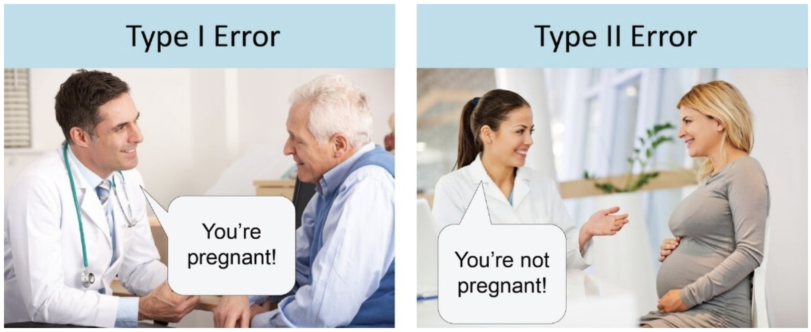
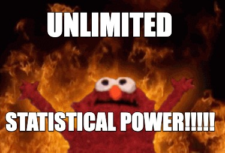
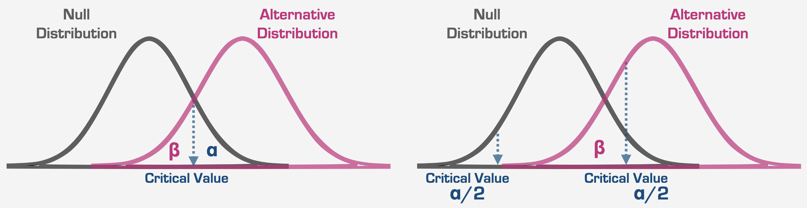
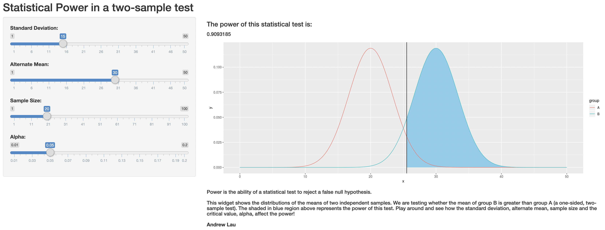

# Reminders

## Homework 3 is available on October 14 and due October 29 (50 points)

## Homework 4 is available on October 21 and due October 29 (7 points)

---

# What are we going to do?

## Recap to give you a big picture

### Hypothesis testing

## Class activity

---

# Statistical inference

## Idea 1

### Let's make a best guess about the population parameter and test if that guess is true  $\rightarrow$ Estimation and hypothesis testing

## Idea 2

### Let's assume we are interested in one sample statistic (e.g., a sample mean) and have the distribution of all the possible sample statistics  $\rightarrow$ Sampling distribution

---

# Hypothesis testing

## State null and alternative hypothesis (from research questions)

## Select the level of significance, i.e., $\alpha$

## Compute the test statistic $\rightarrow$ Lectures 8 - 13

## Make a statistical decision $\rightarrow$ reject or fail to reject the null hypothesis

---

# Example 1

As a clinical psychologist, Maylani wants to know whether drinking coffee improves study productivity. She recruits 100 participants to participate in her study. 50 are coffee drinkers and 50 do not drink coffee (or consume any other caffeine). She found that those who drink coffee had significantly higher productivity scores (with $M=50,\:SD=25$) than those who do not drink coffee (with $M=40,\:SD=20$). The ~~test statistic~~ is 2.21 and *p*-value is .02.

### State the null and alternative hypotheses. Are we using a one-tailed or two-tailed test?
### Select the level of significance (i.e., $\alpha$) Let's use .05 as an $\alpha$ level
### ~~Compute the test statistic (Lectures 8 - 13)~~
### Make a statistical decision (reject or fail to reject the null hypothesis)

---

# Example 1

As a clinical psychologist, Maylani wants to know whether drinking coffee improves study productivity. She recruits 100 participants to participate in her study. 50 are coffee drinkers and 50 do not drink coffee (or consume any other caffeine). She found that those who drink coffee had significantly higher productivity scores (with $M=50,\:SD=25$) than those who do not drink coffee (with $M=40,\:SD=20$). The ~~test statistic~~ is 2.21 and *p*-value is .02.

### State the null and alternative hypotheses. Are we using a one-tailed or two-tailed test?
$H_0:\:\mu_{\text{coffee}}=\mu_{\text{non-coffee}}$| $H_1:\:\mu_{\text{coffee}}>\mu_{\text{non-coffee}}$| one-tailed (Drinking coffee improves productivity)
### Select the level of significance (i.e., $\alpha$) Let's use .05 as an $\alpha$ level
### ~~Compute the test statistic (Lectures 8 - 13)~~
### Make a statistical decision (reject or fail to reject the null hypothesis): Reject the null!

---

# Example 2

An industrial psychologist Angela wants to know whether singing while working affects work productivity. She recruits 100 participants to participate in her study. 50 sing while working and 50 work in silence. On average, she found that those who sing all day had productivity scores of 50 (with $SD=25$), those who work in silence had productivity scores of 45 (with $SD=25$). The ~~test statistic~~ is 1.00, and the *p*-value is .16.

### State the null and alternative hypotheses. Are we using a one-tailed or two-tailed test?
### Select the level of significance (i.e., $\alpha$) Let's use .05 as an $\alpha$ level
### ~~Compute the test statistic (Lectures 8 - 13)~~
### Make a statistical decision (reject or fail to reject the null hypothesis)

---

# Example 2

An industrial psychologist Angela wants to know whether singing while working affects work productivity. She recruits 100 participants to participate in her study. 50 sing while working and 50 work in silence. On average, she found that those who sing all day had productivity scores of 50 (with $SD=25$), those who work in silence had productivity scores of 45 (with $SD=25$). The ~~test statistic~~ is 1.00, and the *p*-value is .16.

### State the null and alternative hypotheses. Are we using a one-tailed or two-tailed test?
$H_0:\:\mu_{\text{sing}}=\mu_{\text{silence}}$| $H_1:\:\mu_{\text{sing}}\neq\mu_{\text{silence}}$| two-tailed (Singing affects work productivity)
### Select the level of significance (i.e., $\alpha$) Let's use .05 as an $\alpha$ level
### ~~Compute the test statistic (Lectures 8 - 13)~~
### Make a statistical decision (reject or fail to reject the null hypothesis): Fail to rejct the null!

---

# Type I and type II errors

## Wait! Revisit statistical decisions...

### Maylani found that drinking coffee increases study productivity. However, **what if drinking coffee has actually no effect on study productivity?**

### Angela found no evidence that singing impacts work productivity. However, **what if singing is actually really bad for work productivity in reality?**

## There can be errors in statistical decision making

---

# Type I and type II errors

## More intuitive example?

---

# Type I error

## Rejecting the null hypothesis when it is true

## Type I error rate is the alpha (i.e., $\alpha$)

## False positive
We think we detected an effect, but in reality, there is not

## Example?
- An allergy test says you are allergic to cats, but you are not. As a consequence, you do not adopt a cat.
- Convict an innocent person of a crime

---

# Type II error

## Failing to reject the null hypothesis when it is false

## Type II error rate is the beta (i.e., $\beta$)

## False negative
We did not detect an effect, but in reality, there is

## Example?
- An allergy test doesn't detect any cat allergy, but you are actually allergic to cats. So, you get sick after the adoption.
- Fail to convict a criminal of a crime

---

# Power

---

# Power

## The ability to reject the null hypothesis when it is false = $1-\beta$

## Alpha (i.e., $\alpha$) and beta (i.e., $\beta$) are related

### When alpha increases $\rightarrow$ power increases, but type I error increases

### When alpha decreases $\rightarrow$ power decreases, so type II error increases

---

# Power

## Understanding the graph...

### Tip 1: See null distribution for type I error (i.e., $\alpha$)
### Tip 2: See alternative distribution for type II error (i.e., $\beta$) and power (i.e., $1-\beta$)

---

# Power

## R Shiny App: https://andrewlau.shinyapps.io/Power/

## See also https://rpsychologist.com/d3/nhst/

---

# Power

.pull-left[
## Power **increases** when...
### Larger sample sizes
### Larger effect sizes
### Smaller spread
### Larger alpha level
### One-tailed test
]

.pull-right[
## Power **decreases** when...
### Smaller sample sizes
### Smaller effect sizes
### Larger spread
### Smaller alpha level
### Two-tailed test
]

---

# Effect size

## Motivation
### Researchers are down to reject the null hypothesis
### Say, we have a *p*-value lower than the $\alpha$ level (e.g., 0.05) $\rightarrow$ Statistical significance
### Do statistically significant results tell you how much the effects are?

---

# Effect size

## Idea
### Quantify the magnitude of the effect $\rightarrow$ Practical significance
### Example: mean differences, strength of the relationships, ...

## Implication
### Check the practical significance on top of the statistical significance
### While we can reject the null hypothesis, the effect can be either small or large!

---

# Summary

## Hypothesis testing steps

- How to state the null and the alternative hypothesis
- Difference between a directional and non-directional hypothesis
- When to reject or fail to reject the null hypothesis

## Type I and type II errors

- What a false positive and false negative is
- Can you think of examples?
- How these two errors are related

---

# Summary

## Power

- What affects power and how
- How to calculate the power

## Effect size

- What is an effect size
- Difference between practical significance and statistical significance

---

# Stop misusing *p*-values!

### Prof. Dr. Rens van de Schoot (https://www.youtube.com/watch?v=JRY2krxYwso)

<iframe width="672" height="378" src="https://www.youtube.com/embed/JRY2krxYwso" title="YouTube video player" frameborder="0" allow="accelerometer; autoplay; clipboard-write; encrypted-media; gyroscope; picture-in-picture" allowfullscreen></iframe>

---

# Class activity

## Case 1

Ihnwhi attends jury duty and has to vote whether the suspect is guilty of robbing a bank or not.

## Can you answer below?
- What would be a type I error?
- What would be a type II error?
- Which error is worse?

---

# Class activity

## Case 2

As a clinical psychologist, Maylani wants to know whether drinking coffee improves study productivity. She recruits 100 participants to participate in her study. 50 are coffee drinkers and 50 do not drink coffee (or consume any other caffeine). She found that those who drink coffee had significantly higher productivity scores (with $M=50,\:SD=25$) than those who do not drink coffee (with $M=40,\:SD=20$). The test statistic is 2.21 and *p*-value is .02.

## Can you answer below?
- What would be a type I error?
- What would be a type II error?
- Maylani replicates this study to see how caffeine works on students. She recruits another sample of 100. In this sample, the mean is the same for both groups, but the standard deviation in both groups is much larger (40 for coffee drinkers and 35 for those who do not drink coffee). How does this change power?

---

# Class activity

## Case 3

An industrial psychologist Angela wants to know whether singing while working affects work productivity. She recruits 100 participants to participate in her study. 50 sing while working and 50 work in silence. On average, she found that those who sing all day had productivity scores of 50 (with $SD=25$), those who work in silence had productivity scores of 45 (with $SD=25$). The test statistic is 1.00, and the *p*-value is .16.

## Can you answer below?
- What would be a type I error?
- What would be a type II error?
- Angela replicates this study. She recruits 500 people (in each group) for the replication study. Which study has higher power to detect an effect?

---

# Class activity

## Are you ready?

### Join https://www.kahoot.it

### My account is free, so maybe 10 people are the maximum...

---

# Before you go home...

## Any questions or comments?

---

# Thanks! Have a nice weekend!

