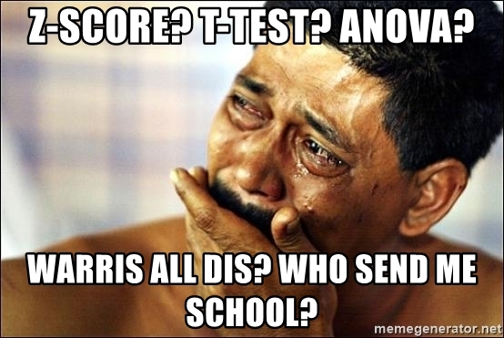
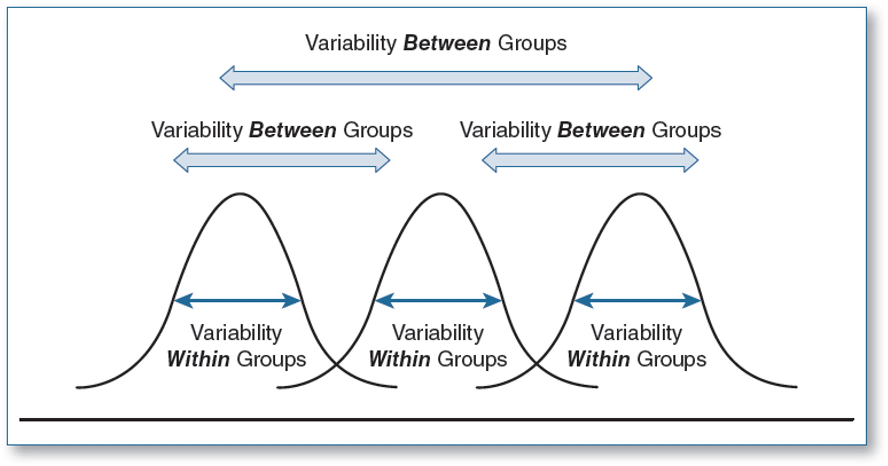
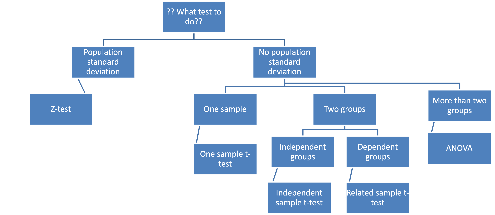
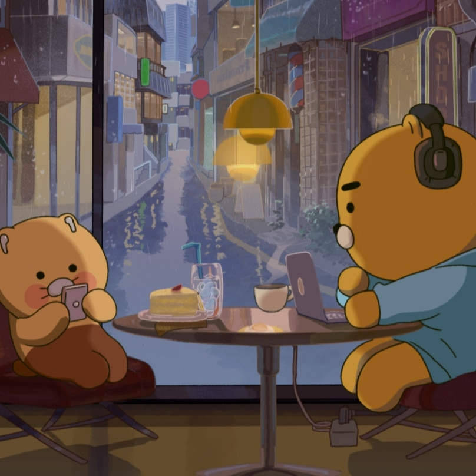

# Reminders

## Homework 3 is **on now** and due October 29 (50 points)

## Homework 4 is **on now** and due October 29 (7 points)

## Difficulties in homework? Join office hours. I am happy to help you!

## Exam 2 is on November 2

---

# What are we going to do?

## Recap to give you a big picture

### Related-sample t-test

### One-way ANOVA

## Do it together

---

# Are you ready?

## z-test, t-test, ANOVA, ANCOVA, MANOVA, MANCOVA, RM-ANCOVA... WHAT?!

### Playing the game of statistical inference about population 'means'

---

# Big picture

---

# Related-sample t-test

## When do we use it?

### Participants included in one sample are dependent on the other sample

## Degrees of freedom

$df=n_{dif}-1$

## Test-statistic (**t-statistic**)

$\LARGE t=\frac{\overline{X}_1-\overline{X}_2}{s_{\overline{dif}}}\;\;\;\text{where}\;\;\;s_{\overline{dif}}=\frac{s_{dif}}{\sqrt{n_{dif}}}$

---

# Related-sample t-test

## Effect size

### Remember the practical significance! Let's quantify the size of effect (if significant)
### Means the magnitude of the mean difference in the number of standard deviation units
### Rule of thumb: 0.2 (small), 0.5 (medium), 0.8 (large)

## In related-sample t-test, the effect size is

$\LARGE d=\frac{\overline{X}_1-\overline{X}_2}{s_{dif}}$

---

# Effect size

.pull-left[
## z-test

$\LARGE d=\frac{\overline{X}-\mu_0}{\sigma_{X}}$

## one-sample t-test

$\LARGE d=\frac{\overline{X}-\mu_{0}}{s_{X}}$
]

.pull-right[
## independent-sample t-test

$\LARGE d=\frac{\overline{X}_1-\overline{X}_2}{s_p}$

## related-sample t-test

$\LARGE d=\frac{\overline{X}_1-\overline{X}_2}{s_{dif}}$
]

---

# Do it together

## Example 1 from Youtube

### https://www.youtube.com/watch?v=Ko_WlL1oF1o

## Example 2

### Does medication lower cholesterol levels? A group of 24 patients received medication to reduce their cholesterol. Patient cholesterol was measured before and after the medication. $\alpha$ = .05.

## Example 3

### Is your current happiness level significantly different from the happiness level in August?

---

# Big picture

---

# One-way ANOVA

## So far, we've only compared two groups (e.g., Lakers vs. Clippers supporters)

### z-test, one-sample t-test, independent-sample t-test, related-sample t-test

## What if we have three groups? (e.g., Lakers, Clippers, and Sacramento Kings supporters)

### ANOVA (= Analysis of Variance)

---

# One-way ANOVA

## Variables

### So far, we think of our variables as different groups

### For ANOVA, think of our variables as multiple levels of the same variable

## That is,

### Instead of comparing Lakers vs. Clippers vs. Sacramento Kings

### We have 'basketball supporters' as the independent variable (*aka*. factor in ANOVA context)

### The 'basketball supporters' has 3 levels: Lakers, Clippers, and Sacramento Kings

---

# One-way ANOVA

## 'N-Way': N = the number of IV (or factor)

### One-way ANOVA: ANOVA using one IV; factorial ANOVA: 2 or more IV

---

# One-way ANOVA

## F-ratio

### test-statistic for ANOVA

### The ratio between the between group-variability and within-group variability

### Larger F-ratio $\rightarrow$ larger portion of between-group variability compared to within-group variability

$\LARGE F = \frac{MS_{between}}{MS_{within}}$

---

# One-way ANOVA

## 'Variance' is the key, and do you remember that SS plays a role in variance?

### Remember?

$\LARGE \sigma^2=\frac{\Sigma_{i=1}^{N}(X_i-\overline{X})^2}{N}$ and $\LARGE s^2=\frac{\Sigma_{i=1}^{n}(X_i-\overline{X})^2}{n-1}$

## SS means the sum of each individual's squared deviation from the mean

$\LARGE SS_{X}=\Sigma_{i=1}^{N}(X_i-\overline{X})^2$

---

# One-way ANOVA

## We 'separate' the between-group variance and within-group variance

$\LARGE SS_{total}=SS_{between}+SS_{within}$

## where

$\LARGE SS_{total}=\Sigma_{i=1}^{N}(X_{ij}-\overline{X})^2\;\;\;\;\;df=N-1$

$\LARGE SS_{between}=\Sigma_{i=1}^{N}(\overline{X}_{j}-\overline{X})^2\;\;\;\;\;df=J-1$

$\LARGE SS_{within}=\Sigma_{i=1}^{N}(X_{ij}-\overline{X}_j)^2\;\;\;\;\;df=N-J$

---

# One-way ANOVA

## Mean squares

$\LARGE MS_{between}=\frac{SS_{between}}{df_{between}}$

$\LARGE MS_{within}=\frac{SS_{within}}{df_{within}}$

## Finally, F-ratio

$\LARGE F = \frac{MS_{between}}{MS_{within}}$

---

# Do it together

## Example

### Some researchers are interested in whether social media use impacts sleep quality

---

# Big picture

---

# Summary

## Related-sample t-test

### When to compute (when comparing dependent samples, e.g., pre-test & post-test) & how to compute?

## Effect sizes

### What it is (magnitude of difference between means)

## One-way ANOVA

### When to compute (when you have more than 2 groups)

---

# Before you go home...

## Exam 2 is on November 2

### Bring red scantron (large and red one)

### Pencil, eraser, pen, calculator, notes, z-table, t-table, F-table

### Check everything is working before the exam!

---

# Before you go home...

## Correct scantron form (otherwise, you will get a score of **0**)

---

# Thanks! Have a nice weekend!

