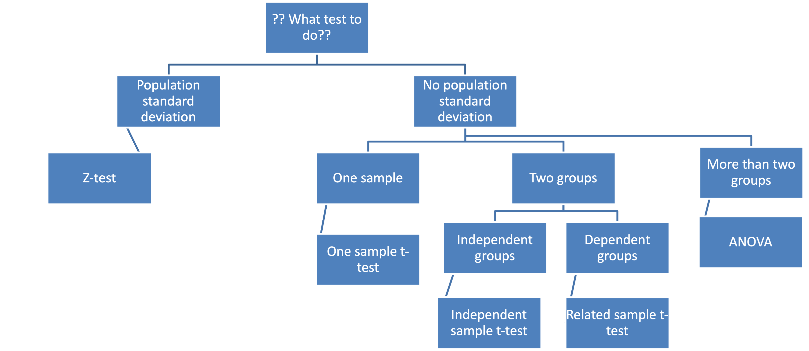

# Reminders

## Homework 3 & 4 due today (57 points)

## Exam 2 is next Tuesday (November 2)

### Prepare the correct scantron form (large red one; see next slide)

### Print z-, t-, and F-table

### Bring calculator, notes, pencil, eraser, and pen

---

# Reminders

## Correct scantron form (otherwise, you will get a score of **0**)

---

# What are we going to do?

## Recap to give you a big picture

### Brief summary

### Effect size in one-way ANOVA

## Ask me any questions

---

# Big picture

---

# Big picture

## Read the question carefully

### Which statistical technique?

### One-tailed or two-tailed?

### Test-statistic

### Critical value from the table

### Effect size

---

# One-way ANOVA

## Effect size

### $\LARGE \eta^2 = \LARGE \frac{SS_{between}}{SS_{total}}$

### Magnitude of the between group effect

### Compares the size of the variance between groups with the total variance

### ~~% of the variance in the DV is explained by the IV

---

# One-way ANOVA

### A pharmaceutical company conducts an experiment to test the effect of new cholesterol medication. The company selects 15 subjects randomly from a larger population. Each subject is randomly assigned to one of three treatment groups. Within each treatment group, subjects receive a different dose of the new medication. In Group 1, subjects receive 0 mg/day; in Group 2, 50 mg/day; and in Group 3, 100 mg/day. After 30 days, doctors measure the cholesterol level of each subject. The results for all 15 subjects appear in the table below:

---

# One-way ANOVA

## In conducting this experiment, the experimenter had two research questions

### 1. Does dosage level have a significant effect on cholesterol level? (hypothesis testing) $\alpha$=0.05

### 2. How strong is the effect of dosage level on cholesterol level? (effect size calculation)

## Fill in the table

---

# One-way ANOVA

## Fill in the table

### 1. Does dosage level have a significant effect on cholesterol level? (hypothesis testing) $\alpha$=0.05

### $F_{crit}(2, 12)=3.89$ $\rightarrow$ reject the null hypothesis
---

# One-way ANOVA

## Fill in the table

### 2. How strong is the effect of dosage level on cholesterol level? (effect size calculation)

### $\eta^2 = \frac{SS_{between}}{SS_{total}} = \frac{6240}{15240}=0.41$

### 41% of the variance in the cholesterol level is explained by the new medication methods

---

# Ask me any questions

---

# Thanks! Good luck with your exam!

