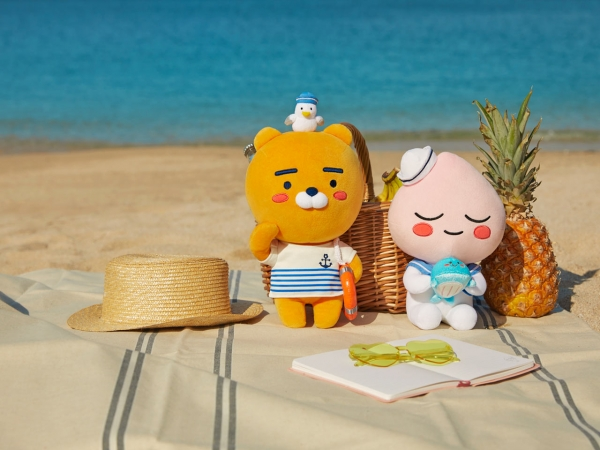

# Who am I?

.pull-left[
## Background/Interests in
- Methodology and Statistics
- Psychology
- Bayesian inference

]

.pull-right[
## Trivia
- Traveled to 26 countries
- Served in the Air Force
- Fan of musicals & Marvel Studios
- Pineapples does not go on pizza

]

---

# What are we going to do?

## Breaking the ice: Dilemmas on Friday

## How to be successful in lab sessions

## Recap to give you a big picture

## Group activity

---

# Dilemmas on Friday

## From Dilemmas op Dinsdag: Choose between the two options!

.pull-left[
There is a chocolate river through your garden.
]

.pull-right[
All the animals do everything you say.
]

---

# Dilemmas on Friday

## How about this?

.pull-left[
Every psychology course is taught at 9 am.
]

.pull-right[
Every psychology course focuses on statistics.
]

---

# How to be successful

## Purpose
Provide extra exposure to statistical concepts and exercises

## What can you expect from me?
**ANY HELP** to be successful on this course :)

## What can I expect from you?
Active participation  
Ready to enjoy the world of statistics  
Be kind to each other

---

# Recap: Research design

## Research design
To answer your research question, how do you plan to carry out research?

## Can you distinguish them?

| Experimental method           | Quasi-experimental method  | Correlational method          |
| :---------------------------- | :------------------------- | :---------------------------- |
| Manipulation of a variable    | Manipulation of a variable | No manipulation of a variable |
| Random assignment             | No random assignment       | Observational                 |
| Causal inference              | Causal inference           | No causal inference           |

## Wait... there are three imrporant terms
Manipulation, random assignment, and causal inference

---

# Recap: Research design

## What is manipulation?
When the independent variables are changed, altered, or influenced by researchers on purpose, such a process is called experimental manipulation (Allen, 2017).

## Are you familiar with random assignment?
Participants are randomly assigned to groups to ensure that group differences stem from intervention rather than preexisting effects.

## What are conditions for causal inference?
1. An observed relationship/pattern
2. Temporal precedence
3. Ruling out alternative explanations

---

# Recap: Measurement

## Measurement
We assign numbers to studied objects (e.g., people, animals) to investigate them.

.pull-left[
## Observable entities
Physically observable  
Tangible characteristics  
Manifest variable

**Examples**  
Height, BMI, and heart rate of people  
Test scores on math and language  
How often you meet your friends a week
]

.pull-right[
## Latent construct
Physically unobservable  
Psychological characteristics  
Latent variable

**Examples**  
Health of people  
Academic achievement  
Extraversion and introversion
]

---

# Recap: Analysis

## Statistical analysis
We employ tools or models to describe, understand, and interpret the relationship observed in the data.

## There are terms we learned!
- Population vs. Sample
- Parameter vs. Statistic
- Descriptive Statistics vs. Inferential Statistics
- Categorical (dichotomous vs. polytomous) Variable vs. Numerical (discrete vs. continuous) Variable

---

# Recap: Analysis

## Let's play with Pokemons

.pull-left[
### Population

]

.pull-right[
### Sample

]

---

# Recap: Analysis

## Types of variables

- Categorical variable: Numbers are just categories
   - Dichotomous variable
   - Polytomous variable
- Numerical variable: Numbers represent magnitude
   - Discrete variable
   - Continuous variable

## Scales of measurement

| Nominal | Ordinal | Interval       | Ratio          |
| :------ | :------ | :------------- | :------------- |
| Named   | Named   | Named          | Named          |
|         | Ordered | Ordered        | Ordered        |
|         |         | Equal interval | Equal interval |
|         |         |                | True 0 value   |
|*Gender* |*GPA (A~F)*|*Temperature* | *Height/Weight*|

---

# Group activity: Work in 4 to 5 people

## Case 1

Ihnwhi is interested in studying the effectiveness of statistics education settings for high school students in the United States. He plans to recruit 300 participants where 100 students are randomly assigned to either off-line large-size classroom setting, off-line small-size classroom setting, and on-line platform setting. Students in each condition subsequently take ten questions so that test scores are obtained.

## Can you answer below?
- What is the research design? Why do you think so?
- Are there any measurements of observable entities or latent constructs?
- What are the population and the sample? Can you guess what would be the parameter and the statistic?
- Are there any variables? What is the type? What is the scale of measurement?

---

# Group activity: Work in 4 to 5 people

## Case 2

Mahdi has recently developed a new scale called UC Merced Student Life Satisfaction (UCMSLS) Scale. The scale contains several questionnaires. For example, one questionnaire asks how often students join extracurricular activities a week (on a 10-point scale from 1 through 10). Another questionnaire asks how much students received financial support from the university in the last semester (in $). With the UCMSLS Scale, he plans to research how life satisfaction is associated with mental stress, GPA, and happiness. Next week, he will start recruiting 300 students out of the whole UC Merced student.

## Can you answer below?
- What is the research design? Why do you think so?
- Are there any measurements of observable entities or latent constructs?
- What are the population and the sample? Can you guess what would be the parameter and the statistic?
- Are there any variables? What is the type? What is the scale of measurement?

---

# Group activity: Work in 4 to 5 people

## Case 3

Sivenesi has been working on a cross-cultural research project about differences in the level of empathy. A sample consists of people with different ethnographic backgrounds (North Americans, South Americans, Africans, Asians, and Europeans). People in each ethnographic condition are asked to complete five questionnaires on the empathy scale. The number of correct questions corresponds to the lowest level of empathy, low level of empathy, neutral, high level of empathy, and the highest level of empathy.

## Can you answer below?
- What is the research design? Why do you think so?
- Are there any measurements of observable entities or latent constructs?
- What are the population and the sample? Can you guess what would be the parameter and the statistic?
- Are there any variables? What is the type? What is the scale of measurement?

---

# Resources & References

## All lecture materials are available at

https://github.com/IhnwhiHeo/PSY010

## To get a PDF format, please print the HTML into the PDF!

- Mac with Safari, Chrome, Firefox: Click on the File menu (near the top left), and then select Print.
- Windows with Edge, IE, Chrome, Firefox: Click on the settings or menu icon (3 dots, 3 bars, or gear near the top right), and then select Print.

## I made a citation from

Allen, M. (2017). *The SAGE encyclopedia of communication research methods*. Sage Publications. https://dx.doi.org/10.4135/9781483381411.n174

---

# Thanks! Have a wonderful weekend!

---
