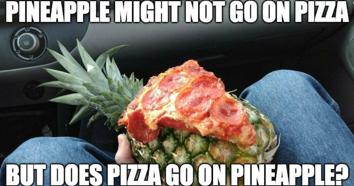
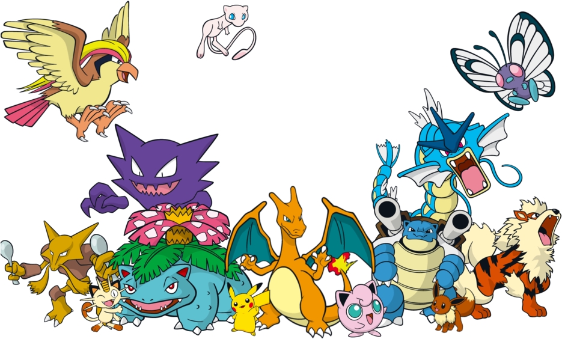

# Who am I?

.pull-left[
## Background/Interests in
- Methodology and Statistics
- Psychology
- Bayesian inference

]

.pull-right[
## Trivia
- Traveled to 26 countries
- Served in the Air Force
- Fan of musicals & Marvel Studios
- Pineapples does not go on pizza

]

---

# What are we going to do?

## Breaking the ice: Dilemmas on Friday

## How to be successful in lab sessions

## Recap to give you a big picture

## Group activity

---

# Dilemmas on Friday

## From Dilemmas op Dinsdag: Choose between the two options!

.pull-left[
There is a chocolate river through your garden.
]

.pull-right[
All the animals do everything you say.
]

---

# Dilemmas on Friday

## How about this?

.pull-left[
Every psychology course is taught at 9 am.
]

.pull-right[
Every psychology course focuses on statistics.
]

---

# How to be successful

## Purpose
Provide extra exposure to statistical concepts and exercises

## What can you expect from me?
**ANY HELP** to be successful on this course :)

## What can I expect from you?
Active participation  
Ready to enjoy the world of statistics  
Be kind to each other

---

# Recap: Research design

## Research design
To answer your research question, how do you plan to carry out research?

## Can you distinguish them?

| Experimental method           | Quasi-experimental method  | Correlational method          |
| :---------------------------- | :------------------------- | :---------------------------- |
| Manipulation of a variable    | Manipulation of a variable | No manipulation of a variable |
| Random assignment             | No random assignment       | Observational                 |
| Causal inference              | Causal inference           | No causal inference           |

## Wait... there are three imrporant terms
Manipulation, random assignment, and causal inference

---

# Recap: Research design

## What is manipulation?
To investigate the effect of the independent variables, researchers vary the conditions/levels of the independent variables on purpose. This process is referred to as manipulation.

## What is the purpose of the random assignment?
Participants are randomly assigned to groups to ensure that group differences stem from intervention/treatment/control rather than preexisting effects.

## What are the conditions for causal inference?
1. An observed relationship/pattern
2. Temporal precedence
3. Ruling out alternative explanations

---

# Recap: Measurement

## Measurement
We assign numbers to studied objects (e.g., people, animals) to investigate them.

.pull-left[
## Observable entities
Physically observable  
Tangible characteristics  
Manifest variable

**Examples**  
Height, BMI, and heart rate of people  
Test scores on math and language  
How often you meet your friends a week
]

.pull-right[
## Latent construct
Physically unobservable  
Psychological characteristics  
Latent variable

**Examples**  
Health of people  
Academic achievement  
Extraversion and introversion
]

---

# Recap: Analysis

## Statistical analysis
We employ tools or models to describe, understand, and interpret the relationship observed in the data.

## There are terms we learned!
- Population vs. Sample
- Parameter vs. Statistic
- Descriptive Statistics vs. Inferential Statistics
- Categorical (dichotomous vs. polytomous) Variable vs. Numerical (discrete vs. continuous) Variable

---

# Recap: Analysis

## Let's play with Pokemons

.pull-left[
### Population

]

.pull-right[
### Sample

]

---

# Recap: Analysis

## Types of variables

- Categorical variable: Numbers are just categories
   - Dichotomous variable
      - *result of coin toss: heads or tails*
   - Polytomous variable
      - *country of origin, Letter grade (A-F)*
   
- Numerical variable: Numbers represent magnitude
   - Discrete variable
      - *the number of people*
   - Continuous variable
      - *age, temperature, height, weight*

---

# Group activity

## Case 1

Ihnwhi studied the effect of statistics education settings for high school students in the United States. He recruited 300 students in total. Next, 100 students were randomly assigned to either an offline small-size classroom, an offline large-size classroom, or an online platform. Students in each condition subsequently took an exam of 20 questions. The average score was 15.7 for the offline small-size classroom, 8.1 for the offline large-size classroom, and 9.4 for the online platform.

## Can you answer below?
- What is the research design? Why do you think so?
- Are there any observable entities or latent constructs?
- What are the population and the sample? Can you guess what would be the parameter and the statistic?
- Are there any variables? What is the type?

---

# Group activity

## Case 2

Matthew is interested in investigating the relationship between life satisfaction and academic achievement for UC Merced students. He plans to recruit 150 students from all the departments. Then, he will administer two questions to measure life satisfaction. One asks how often students join extracurricular activities a week (on a 10-point scale from 1 through 10). Another questionnaire asks how much students receive financial support from the university this semester (in $). For academic achievement, he will collect the GPA (A~F) of students. He expects that the higher the measures of life satisfaction are, the higher the measure academic achievement is.

## Can you answer below?
- What is the research design? Why do you think so?
- Are there any observable entities or latent constructs?
- What are the population and the sample? Can you guess what would be the parameter and the statistic?
- Are there any variables? What is the type?

---

# Group activity

## Case 3

Alejandra has been working on a cross-cultural research project about differences in the level of empathy. A sample consists of 2000 participants with different ethnographic backgrounds (Americans, Africans, Asians, and Europeans). Participants are asked to respond to several empathy items to measure their empathy level. The empathy level is categorized as the lowest level, lower level, neutral level, higher level, and the highest level. She expects that there are no differences in the level of empathy between different ethnographic backgrounds, both in the sample and the population.

## Can you answer below?
- What is the research design? Why do you think so?
- Are there any observable entities or latent constructs?
- What are the population and the sample? Can you guess what would be the parameter and the statistic?
- Are there any variables? What is the type?

---

# Resources

## Lab materials are available at

https://github.com/IhnwhiHeo/PSY010

## How to print the HTML into the PDF

- Mac with Safari, Chrome, Firefox: Click on the File menu (near the top left), and then select Print. Next, save as PDF or print to PDF.
- Windows with Edge, IE, Chrome, Firefox: Click on the settings or menu icon (3 dots, 3 bars, or gear near the top right), and then select Print. Next, save as PDF or print to PDF.

---

# Thanks! Have a wonderful weekend!

