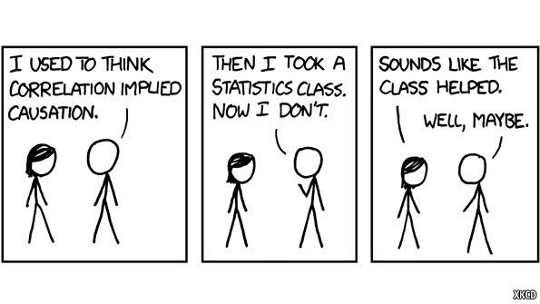

# Some announcements

## Boost your GPA

### Extra credit assignments on April 21 & April 28

## Homework 6

### Will be published tomorrow

## Lab 11 (next Wednesday)

### Will be our final lab meeting

---

# What are we going to do?

## Recap to give you a big picture

### Two-Way ANOVA

### Correlation

<br>

## Q&A session

---

# ANOVA terminology

## N-way ANOVA (# of factors)

### There are N independent variables (IVs = factors = grouping variables = categorical variables)

### N = 1 $\rightarrow$ One-way ANOVA = ANOVA with 1 IV

### N = 2 $\rightarrow$ Two-way ANOVA = ANOVA with 2 IVs

### N = 2 or more $\rightarrow$ Factorial ANOVA $\rightarrow$ Start to consider interactions

---

# ANOVA terminology

## A $\times$ B $\times$ C $\times$ ... $\times$ D ANOVA (# of levels)

### 4 $\times$ 4 $\times$ 4 ANOVA = ANOVA with 3 IVs, each with 4 levels

### 3 $\times$ 5 ANOVA = ANOVA with 2 IVs, one with 3 levels and the other with 5 levels

### 4 $\times$ 2 $\times$ 5 ANOVA = ?

---

# Factorial ANOVA hypothesis

## Two-way ANOVA <br> $\rightarrow$ null hypothesis $H_0$: Nothing is going on. No effect (no difference)!

### $H_0$: IV1 does not have a significant effect on DV <br> = Group means on DV across levels in IV1 are not different

### $H_0$: IV2 does not have a significant effect on DV <br> = Group means on DV across levels in IV2 are not different

### $H_0$: Interaction between IV1 and IV2 does not have a significant effect on DV

---

# Factorial ANOVA hypothesis

## Two-way ANOVA <br> $\rightarrow$ alternative hypothesis $H_1$: Something is going on. There is an effect!

### $H_1$: IV1 has a significant effect on DV <br> = Group means on DV across levels in IV1 are different

### $H_1$: IV2 has a significant effect on DV <br> = Group means on DV across levels in IV2 are different

### $H_1$: Interaction between IV1 and IV2 has a significant effect on DV

---

# Factorial ANOVA table

<center>

</center>

### Instead of calculating $SS_{AB}$, we use...

### $SS_{Total}=SS_A+SS_B+SS_{AB}+SS_{Within}$ In addition to this, also...

### $df_{Total}=df_A+df_B+df_{AB}+df_{Within}$

---

# Factorial ANOVA table

<center>

</center>

### Do you remember how to find the critical F-ratio in the F-table? :)

---

# Factorial ANOVA table

## Effect size for factorial ANOVA: Partial eta-squared $\eta^2_{p}$

### $\Large \eta^2_{pA} = \frac{SS_A}{SS_A+SS_{Within}}$

### $\Large \eta^2_{pB} = \frac{SS_B}{SS_B+SS_{Within}}$

### $\Large \eta^2_{pAB} = \frac{SS_{AB}}{SS_{AB}+SS_{Within}}$

---

# Factorial ANOVA table

<center>

</center>

### For example, <br> $\eta^2_{pA} = \frac{SS_A}{SS_A+SS_{Within}} = \frac{54}{54+6} = \frac{54}{60} = .90$

### Factor A accounts for 90% of the between-subjects variance in DV

---

# Effect

## Wait... we have been using a word **effect** a lot...

### Null hypothesis (no effect), alternative hypothesis (there is an effect), effect size...

<br>

## Let me ask you: What is an effect in statistics?

---

# Effect

## Intuitively, effect means **'differences'** in statistics!

### Null hypothesis $\rightarrow$ no effect $\rightarrow$ no difference

### Alternative hypothesis $\rightarrow$ there is an effect $\rightarrow$ there is a difference

### Effect size $\rightarrow$ How big our differences are

---

# Effect

## Main effect and interaction effect are also about 'differences'!

### Remember, ANOVA is all about comparing means...

## Working example

### Two-way ANOVA where two factors are school type and region

### Dependent variable: Happiness

### School type (UC Merced and Merced College) & Region (California and Massachusetts)

---

# Main effect

## Mean differences across the levels of a single factor

### An effect of a single factor averaged across levels of the other factors

### Whether there are mean differences in happiness between UC Merced and Merced College <br>(or between California and Massachusetts)

### Differences in marginal means

## N-way ANOVA $\rightarrow$ There are N main effects

### Two-way ANOVA $\rightarrow$ Two main effects!

---

# Main effect

## Mean differences across the levels of a single factor

### An effect of a single factor averaged across levels of the other factors

### Differences in marginal means

<center>

</center>

---

# Main effect

## Mean differences across the levels of a single factor

### An effect of a single factor averaged across levels of the other factors

### Differences in marginal means

<center>

</center>

---

# Main effect

## Mean differences across the levels of a single factor

### An effect of a single factor averaged across levels of the other factors

### Differences in marginal means

<center>

</center>

---

# Main effect

<center>

</center>

---

# Main effect

<center>

</center>

---

# Main effect

<center>

</center>

---

# Interaction effect

## If an effect of a single factor differs across levels of the other factors

### Mean differences at each level of one factor change across the levels of the other factors

### Whether the mean differences in happiness between two levels of school type (or region) change across the levels of region (or school type)

### Differences in differences $\rightarrow$ unparalleled lines

## N-way ANOVA $\rightarrow$ There are $2^N−N−1$ interaction effects

### Two-way ANOVA $\rightarrow$ One interaction effect!

---

# Interaction effect

## If an effect of a single factor differs across levels of the other factors

### Mean differences at each level of one factor change across the levels of the other factors

### Differences in differences $\rightarrow$ unparalleled lines

<center>

</center>

---

# Interaction effect

<center>

</center>

---

# Note

## Whenever we say there are whether main effect or interaction effect, <br> this does not necessarily mean these effects are statistically significant

## It is enough for us to suspect there might be

## To check statistical significance <br> $\rightarrow$ *p*-value < $\alpha$ $\rightarrow$ Observed F value > Critical F value

---

# Descanso

## Stretch yourself :)

<center>

</center>

---

# Correlation

.pull-left[
## Do you remember scatterplot?

### Shows how two variables are related

```{r sca1, eval=FALSE}
plot(mtcars$wt, mtcars$mpg,
   main="Scatterplot Example",
   xlab="Car Weight ",
   ylab="Miles Per Gallon ", pch=19)
```
]

.pull-right[
```{r, ref.label="sca1", echo=FALSE}
```
]

---

# Correlation

## Goal

### To describe a relationship between two variables (i.e., how two variables are related)

## Real-life examples

### The longer time you drive, the more gasoline your will need

### The taller the person is, the heavier the person is

---

# Correlation

## Does not mean causation

<center>

</center>

---

# Correlation

## Two key ideas

### Direction $\rightarrow$ positive vs. negative

### Strength $\rightarrow$ perfect vs. strong vs. weak vs. no

<br>

## Need to know how to interpret

### Scatterplot

### Correlation coefficient

---

# Correlation

## Direction

### Positive $\rightarrow$ As one variable increases, the other increases

### Negative $\rightarrow$ As one variable increases, the other decreases

<br>

## Strength

### How much two variables covary $\rightarrow$ Degree to which the data fall on a straight line

---

# Correlation

## Scatterplot

### One variable is on the x-axis whereas the other variable is on the y-axis

<br>

## Correlation coefficient

### Correlation coefficient ragnes from -1 (perfect negative) to 1 (perfect positive)

---

# Correlation

## Direction and strength

<center>

</center>

---

# Correlation

## Pearson's correlation coefficient

### A statistic that describes the direction and the strength of the linear relationship

$\LARGE r = \frac{SS_{XY}}{\sqrt{SS_XSS_Y}}$

### $SS_{XY}$ is the sum of products of deviations for two variables X and Y
### $SS_{X}$ is the sum of squares for one variable X
### $SS_{Y}$ is the sum of squares for the other variable Y

---

# Hypothesis teseting - Correlation

### 1. State the null and alternative hypothesis

### 2. Choose your $\alpha$-level of significance

### 3. Determine the degrees of freedom

### 4. Locate the critical r value

### 5. Calculate Pearson's r

### 6. Compare observed and critical r value $\rightarrow$ Reject the null hypothesis if $|r_{obt}| > |r_{crit}|$

---

# Hypothesis teseting - Correlation

## State hypotheses

### $H_0:\:r=0$ <br>The population correlation coefficient between time and satisfaction is zero.

### $H_1:\:r\neq0$ <br>The population correlation coefficient between time and satisfaction is different from zero.

## Choose your $\alpha$-level of significance

### Let's use two-tailed test with the $\alpha$-level of 0.05

---

# Hypothesis teseting - Correlation

## Determine the degrees of freedom

### $df=n-2$ where $n$ refers to the sample size

---

# Hypothesis teseting - Correlation

## Locate the critical r value from the correlation table

<center>

</center>

---

# Hypothesis teseting - Correlation

## Pearson's correlation coefficient $\leftarrow$ standardized covariance

### Formula is as follows:

$\LARGE r = \frac{SS_{XY}}{\sqrt{SS_XSS_Y}}$

### $SS_{XY}$ is the sum of products of deviations for two variables X and Y
### $SS_{X}$ is the sum of squares for one variable X
### $SS_{Y}$ is the sum of squares for the other variable Y

---

# Effect size and R-squared

## Effect size ( $r$)

### 0.1 (small), 0.3 (medium), 0.5 (large)

<br>

## Coefficient of determination ( $r^2$)

### The proportion of Y explained by X

---

# Q&A session

## Any questions?

<center>

</center>

---

# Before you go home...

## Lab materials are available at

### https://github.com/IhnwhiHeo/PSY010

<br>

## Any questions or comments?

### Office hours or my email

---

# Thanks! Have a good one!

<center>

</center>
