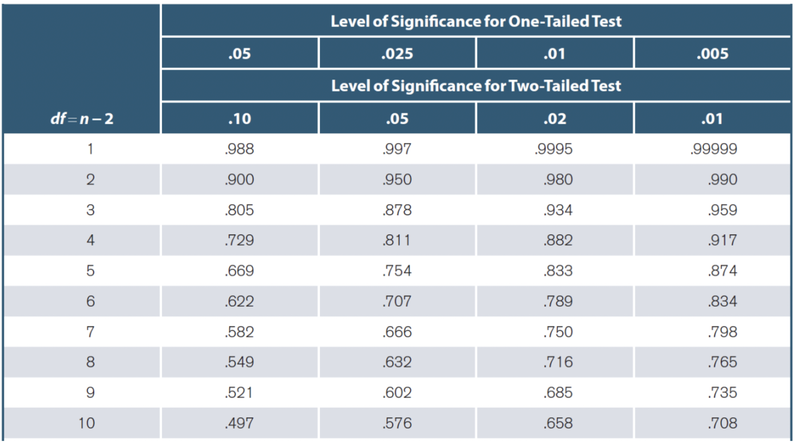

# Some announcements

## Assignments

### Extra credit assignments 2 is due April 29 (Friday)

### Homework 6 is due May 3 (Tuesday)

<br>

## Final exam

### Exam 3 is on May 5 (Thursday)

### Scantron!

---

# Some announcements

## Scantron form

<center>

</center>

---

# What are we going to do?

## Recap to give you a big picture

### Correlation

### Regression

### ... and Metascience

<br> 

## Do it together

---

# It's been a long, long semester

<center>

</center>

---

# It's been a long, long semester

## What you've learned...

### Fundamentals (variables, statistic/parameter), descriptive vs. inferential statistics, measurement scale (nominal, ordinal, interval, ratio), data visualization (bar chart, pie chart, histogram, scatterplot), central tendency (mean, median, mode), variability (range, variance, standard deviation), normal distribution, z-score, central limit theorem, standard error, (frequentist) null hypothesis significance testing, significance level, p-value, z-test, test-statistic, effect size (Cohen's d, eta-squared, partial eta-squared, omega-squared), z-table, t-test (one-sample, independent-sample, related-sample), t-table, degrees of freedom, type I and type II error, statistical power, one-way ANOVA (sum of squares, mean square, F-value), F-table, two-way ANOVA, main effect, interaction effect, correlation, correlation table, coefficient of determination, regression, slope, intercept

---

# Correlation

.pull-left[
## Do you remember scatterplot?

### Shows how two variables are related

```{r sca1, eval=FALSE}
plot(mtcars$wt, mtcars$mpg,
   main="Scatterplot Example",
   xlab="Car Weight ",
   ylab="Miles Per Gallon ", pch=19)
```
]

.pull-right[
```{r, ref.label="sca1", echo=FALSE}
```
]

---

# Correlation

## Goal

### To describe a relationship between two variables (i.e., how two variables are related)

<br>

## Real-life examples

### The longer time you drive, the more gasoline your will need

### The taller the person is, the heavier the person is

---

# Correlation

## Does not mean causation

<center>

</center>

---

# Correlation

## Two key ideas

### Direction $\rightarrow$ positive vs. negative

### Strength $\rightarrow$ perfect vs. strong vs. weak vs. no

<br>

## Need to know how to interpret

### Scatterplot

### Correlation coefficient

---

# Correlation

## Direction

### Positive $\rightarrow$ As one variable increases, the other increases

### Negative $\rightarrow$ As one variable increases, the other decreases

<br>

## Strength

### How much two variables covary $\rightarrow$ Degree to which the data fall on a straight line

---

# Correlation

## Scatterplot

### One variable is on the x-axis whereas the other variable is on the y-axis

<br>

## Correlation coefficient

### Correlation coefficient ragnes from -1 (perfect negative) to 1 (perfect positive)

---

# Correlation

## Direction and strength

<center>

</center>

---

# Correlation

## Pearson's correlation coefficient

### A statistic that describes the direction and the strength of the linear relationship

$\LARGE r = \frac{SS_{XY}}{\sqrt{SS_XSS_Y}}$

### $SS_{XY}$ is the sum of products of deviations for two variables X and Y
### $SS_{X}$ is the sum of squares for one variable X
### $SS_{Y}$ is the sum of squares for the other variable Y

---

# Hypothesis teseting - Correlation

### 1. State the null and alternative hypothesis

### 2. Choose your $\alpha$-level of significance

### 3. Determine the degrees of freedom

### 4. Locate the critical r value

### 5. Calculate Pearson's r

### 6. Compare observed and critical r value $\rightarrow$ Reject the null hypothesis if $|r_{obt}| > |r_{crit}|$

---

# Hypothesis teseting - Correlation

## State hypotheses

### $H_0:\:r=0$ <br>The population correlation coefficient is zero.

### $H_1:\:r\neq0$ <br>The population correlation coefficient is different from zero.

## Choose your $\alpha$-level of significance

### We usually use the $\alpha$-level of 0.05

---

# Hypothesis teseting - Correlation

## Determine the degrees of freedom

### $df=n-2$ where $n$ refers to the sample size

---

# Hypothesis teseting - Correlation

## Locate the critical r value from the correlation table

<center>

</center>

---

# Hypothesis teseting - Correlation

## Pearson's correlation coefficient $\leftarrow$ standardized covariance

### Formula is as follows:

$\LARGE r = \frac{SS_{XY}}{\sqrt{SS_XSS_Y}}$

### $SS_{XY}$ is the sum of products of deviations for two variables X and Y
### $SS_{X}$ is the sum of squares for one variable X
### $SS_{Y}$ is the sum of squares for the other variable Y

---

# Effect size and R-squared

## Effect size ( $r$)

### 0.1 (small), 0.3 (medium), 0.5 (large)

<br>

## Coefficient of determination ( $r^2$)

### The proportion of Y explained by X

---

# Do it together - Correlation

<center>

</center>

---

# Regression

## Goal

### To predict values of the dependent variable (Y) from values of the independent variable (X)

<br>

## Real-life examples

### If you drive 5 hours, how many gallons of gasoline you will need

### If the person is 6 feet, how heavy the person would be

---

# Regression

## Regression equation

### $Y' = a + bX$

### $Y'$ is a predicted value of the dependent variable $Y$ <br> $X$ is an individual value on the independent variable $X$

### $a$ is an intercept $\rightarrow$ a value of $Y$ when $X$ is 0 <br> $b$ is a slope $\rightarrow$ rate of change in $Y$ when $X$ changes by one-unit (*aka*. steepness)

---

# Regression

## Slope $\rightarrow$ $b$

### $Y' = a + bX$

### Rate of change in $Y$ when $X$ changes by one-unit (*aka*. steepness of a regression line)

### $b = \frac{SS_{XY}}{SS_X}$

### $SS_{XY}$ is the sum of products of deviations for two variables X and Y <br> $SS_{X}$ is the sum of squares for one variable X

---

# Regression

## Intercept $\rightarrow$ $a$

### $Y' = a + bX$

### A value of $Y$ when $X$ is 0

### $a = \bar{Y} - b\bar{X}$

### $\bar{Y}$ is the mean of the dependent variable $Y$ <br> $\bar{X}$ is the mean of the independent variable $X$

---

# Hypothesis testing - Regression

## State hypotheses

### $H_0:\:\beta=0$ <br>Regression slope is 0 in the population (no effect) <br> The independent variable predicts nothing about the dependent variable

### $H_1:\:\beta\neq0$ <br>Regression slope is different from 0 in the population (there is an effect) <br> The independent variable predicts something about the dependent variable

### $\beta$ is the population regression slope

---

# Hypothesis testing - Regression

## Choose your $\alpha$-level of significance

### We usually use the $\alpha$-level of 0.05

<br>


## Compute the test-statistic

### z-test or t-test depending on whether you know the population standard deviation


---

# Hypothesis testing - Regression

## Make a decision

### Refer to a z-table or t-table

### Find a critical z-value or critical t-value


## Reject the null hypothesis if

### *p*-value < $\alpha$-level

### $|z_{obt}| > |z_{crit}|$ $\Longleftrightarrow$ $|z_{obt}| > |z_{crit}|$

---

# Do it together - Regression

<center>

</center>

---

# Metascience

## Recall that I kept emphasizing the problems of p-values... but why?

---

# Metascience

## The replication crisis in psychology

### Only 36% of the significant findings (p-value below 0.05) was replicable

<center>

</center>

---

# Metascience

## One of the problems pointed out was the p-value

<center>

</center>

---

# Metascience

## A movement to redefine or ban the p-value

<center>

</center>

---

# Metascience

## Stop using p-values!

### Prof. Dr. Rens van de Schoot (https://www.youtube.com/watch?v=owb5A8lVS0o)

<center>

</center>

---

# Metascience

## Open Science Movement

<center>

</center>

---

# Concluding remark

## What I want to convey to you...

### Be critical in doing everything in your life

### Be transparent in doing science

### Enjoy your undergraduate life (jealous of you!)

---

# Before we finish our semester...

## Any **FINAL** questions or comments?

<center>

</center>

---

# Thank you for the great semester :) Cheers!

<center>

</center>
