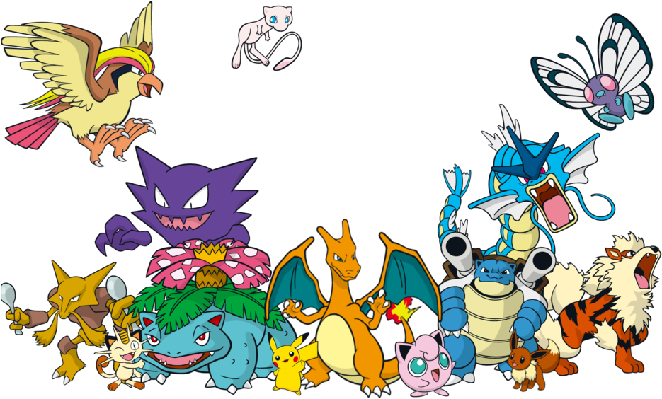

# Welcome to PSY 010 lab sessions!

## Are you ready?

---

# Who am I?

.pull-left[
## Background/Interests in
- Methodology and Statistics
- Psychology
- Bayesian inference

]

.pull-right[
## Trivia
- Traveled to 26 countries
- Served in the Air Force
- Fan of musicals & Marvel Studios
- Pineapples does not go on pizza

]

---

# What are we going to do?

## Breaking the ice: Dilemmas on Wednesday $\rightarrow$ Attendance check!

## How to be successful in lab sessions

## Recap to give you a big picture

### Statistics, populations, and samples

### Variables and scales of measurement

## Food for thought

---

# Dilemmas on Wednesday

## Attendance check for lab 1

### Please let me know your choice and reason for the following two dilemmas (any simple reason is enough!)

### Send your responses to my email **iheo2@ucmerced.edu** by **February 2, 7:29 am**

### Late submission is not accepted!

### Curious about your choice!

### When in-person, I will do the head-count before the lecture starts

---

# Dilemmas on Wednesday

## From Dilemmas op Dinsdag: Choose between the two options!

.pull-left[
There is a chocolate river through your garden.
]

.pull-right[
All the animals do everything you say.
]

---

# Dilemmas on Wednesday

## How about this?

.pull-left[
Every psychology course is taught at 9 am.
]

.pull-right[
Every psychology course focuses on statistics.
]

---

# How to be successful

## Purpose
### Provide extra exposure to statistical concepts and exercises

## What can you expect from me?
### **ANY HELP** to be successful on this course :) Please check your mailbox for communication!

## What can I expect from you?
### (1) Active participation, (2) Ready to enjoy the world of statistics, and (3) Be kind to each other

---

# Statistics, populations, and samples

## Why do we do STATS?

### To understand the characteristics of something with our data

 

## Two ways of understanding

### Descriptive statistics: Summarise and illustrate data we have

### Inferential statistics: Infer characteristics from smaller data to larger data

---

# Statistics, populations, and samples

## Population
### Entire set of cases   $\rightarrow$ What we want to have & We use a *parameter* to describe population's characteristics   ex. Whole students at UC Merced

## Sample
### Subset of cases   $\rightarrow$ What we usually have & We use a *statistic* to describe sample's characteristics   ex. PSY 010 lab mates

---

# Statistics, populations, and samples

## Let's play with Pokemons

.pull-left[
### Population

]

.pull-right[
### Sample

]

---

# Variables and scales of measurement

## Variables
### Any characteristic of something we are interested $\rightarrow$ Anything that can vary

## Why do variables matter?
### Statistical analysis plays with variables

## Don't be confused with values of variables
### Age is a variable where age itself can vary across different individuals   20 is one possible value of the variable age

---

# Variables and scales of measurement

## Types of variables

### Quantitative vs. qualitative

### Continuous vs. discrete

---

# Variables and scales of measurement

## Quantitative variable (= numerical variable)

### Numbers represent magnitude
### The number of people, age, temperature, height, weight

## Qualitative variable (= categorical variable)

### Focus is put on categories
### Country of origin, result of coin toss

---

# Variables and scales of measurement

## Continuous variables

### Variables have values on a full continuum of range
### Age, height, weight, time

## Discrete variables

### Variables have values that are specific and separate
### Number of people, ethnicity

---

# Variables and scales of measurement

## Think about the following:

### What is the type of the variable GPA? Is it categorical or numerical?

---

# Variables and scales of measurement

## To be quantitative or qualitative, that's the problem

### If measured on a letter grade (e.g., A, B, C), it is qualitative (i.e., categorical)

### If measured on a numerical grade (e.g., 4.0, 3.2, 3.7), it is quantitative (i.e., numerical)

 

## To fully define and understand a variable,   we need to know how that variable is **measured**.

---

# Variables and scales of measurement

## The measurement scale

### Type of information provided by the values of a variable

## Four scales of measurement
| Nominal | Ordinal | Interval       | Ratio          |
| :------ | :------ | :------------- | :------------- |
| Named   | Named   | Named          | Named          |
|         | Ordered | Ordered        | Ordered        |
|         |         | Equal interval | Equal interval |
|         |         |                | True 0 value   |
|      |         |                |                |
|*Gender*    |*Letter grade (A~F)*|*Temperature* | *Height/Weight*|
|*Ethnicity* |*Political ideology*|*IQ Scores*   | *Age*          |
|*Color*     |*Likert scale*      |*SAT Scores*  | *Income*       |

---

# Food for thought

## Can you tell me whether the following variables are...

### Letter grade   Political affiliation   Time   Favorite TV Shows   Social Security Number   Salary   SAT Score

### (1) Continuous or discrete?, (2) Quantitative or qualitative?, and (3) Scale of measurement?

### Answers will be provided before the next lab session :)

---

# Before you go home...

## Lab materials are also available at

### https://github.com/IhnwhiHeo/PSY010

 

## Any questions or comments?

### Office hours or my email

---

# Thanks! Have a good one!

