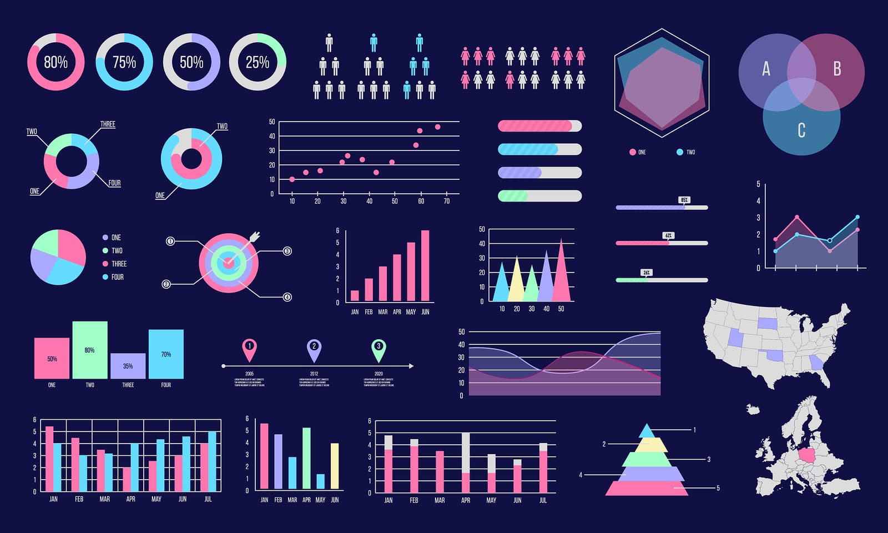
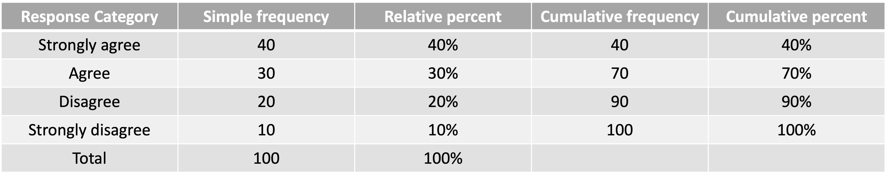
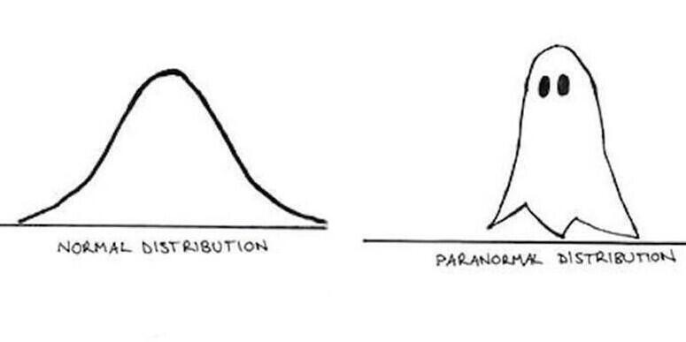

# What are we going to do?

## Recap to give you a big picture

### Data visualization

### Distribution

## Food for thought

---

# Some announcements

## Lab 3 on February 9 is in person

### Check your where your lecture room is!

## HW 1 (20 points) deadline

### February 3 (Thursday) at 11:59 pm on CatCourses

## Attendance check

### Find one example of data visualization in your life and let me know what it is to my email **iheo2@ucmerced.edu** (simple description is enough) - hint: NEWS? Instagram? Facebook?

---

# Data visualization

## You can find everywhere *visualized* data

<center>

</center>

---

# Data visualization

## You want something fun?!

<center>

</center>

---

# Data visualization

## Why do we visualize data?
### Once we collect data about variables of interest, <br>we want to present important **information** from the data!

## What did we learn?
- Frequency table
  - Simple frequency distribution
  - Cumulative frequency distribution
  - Relative percent distribution
  - Cumulative percent distribution
- Bar chart
- Pie chart
- Histogram

---

# Data visualization

## Frequency table
### To show the count or the percentage of data points

<br>

## How can we distinguish different kinds of frequencies

|                     | Count                  | Percentage                    |
| :------------------ | :--------------------- | :---------------------------- |
| **Non Accumulation**| Simple frequency distribution | Relative percent distribution | 
| **Accumulation**    | Cumulative frequency distribution | Cumulative percent distribution | 

---

# Data visualization

## Frequency table

### Itamar, a data scientist at Marvel Studios, collected responses from 100 people to the question: "Spider-Man: No Way Home was great fun".

<center>

</center>

---

# Data visualization

## Bar chart

### We use rectangular bars to represent the count or the proportion of qualitative data

<br>

## Shall we see some examples?

### R code from https://www.statmethods.net/

---

# Data visualization

.pull-left[
## Can you understand the plot?
```{r bar1, eval=FALSE}
# Simple Bar Plot
counts <- table(mtcars$gear)
barplot(counts, main="Car Distribution",
   xlab="Number of Gears")
```
]

.pull-right[
```{r, ref.label="bar1", echo=FALSE}
```
]

---

# Data visualization

.pull-left[
## Horizontal bars are possible.
```{r bar2, eval=FALSE}
# Simple Horizontal Bar Plot with Added Labels
counts <- table(mtcars$gear)
barplot(counts, main="Car Distribution",
        horiz=TRUE,
  names.arg=c("3 Gears", "4 Gears", "5 Gears"))
```
]

.pull-right[
```{r, ref.label="bar2", echo=FALSE}
```
]

---

# Data visualization

.pull-left[
## You can even stack the bars!
```{r bar3, eval=FALSE}
# Stacked Bar Plot with Colors and Legend
counts <- table(mtcars$vs, mtcars$gear)
barplot(counts,
main="Car Distribution by Gears and Engines",
xlab="Number of Gears",
col=c("darkblue","darkgreen"),
legend = rownames(counts))
```

]

.pull-right[
```{r, ref.label="bar3", echo=FALSE}
```
]

---

# Data visualization

## Pie chart

### We use circular pies to represent the count or the proportion of qualitative data

<br>

## Shall we see some examples?

### R code from https://www.statmethods.net/

---

# Data visualization

.pull-left[
## Can you understand the plot?
```{r pie1, eval=FALSE}
# Simple Pie Chart
slices <- c(16, 12, 4, 10, 8)
lbls <-
  c("US", "Canada", "Mexico",
    "South Korea", "Vetnam")
pie(slices, labels = lbls,
    main="Pie Chart of Countries")
```
]

.pull-right[
```{r, ref.label="pie1", echo=FALSE}
```
]

---

# Data visualization

.pull-left[
## Let me present the 3D plot.
```{r pie2, eval=FALSE}
# 3D Exploded Pie Chart
library(plotrix)
slices <- c(16, 12, 4, 10, 8)
lbls <- c("US", "Canada", "Mexico",
    "South Korea", "Vetnam")
pie3D(slices,labels=lbls,explode=0.1,
   main="Pie Chart of Countries ")
```
]

.pull-right[
```{r, ref.label="pie2", echo=FALSE}
```
]

---

# Data visualization

## Histogram

### We use bins or buckets to represent the frequency distribution of data

<br>

## Shall we see some examples?

### R code from https://www.statmethods.net/

---

# Data visualization

.pull-left[
## Can you understand the plot?
```{r hist1, eval=FALSE}
# Simple Histogram
hist(mtcars$mpg, col="lightblue")
# mpg stands for miles per gallon
```
]

.pull-right[
```{r, ref.label="hist1", echo=FALSE}
```
]

---

# Data visualization

.pull-left[
## I increased the number of breaks.
```{r hist2, eval=FALSE}
# Colored Histogram with Different Number of Bins
hist(mtcars$mpg, breaks=12, col="lightblue")
```
### Depending on the number of breaks, <br>we can either gain or lose important information inherent in data.
]

.pull-right[
```{r, ref.label="hist2", echo=FALSE}
```
]

---

# Data visualization

.pull-left[
## Superimpose the curve that fits the data! $\rightarrow$ Smoothing
```{r hist3, eval=FALSE}
# Add a Normal Curve (Thanks to Peter Dalgaard)
x <- mtcars$mpg
h<-hist(x, breaks=10, col="lightblue",
   xlab="Miles Per Gallon",
   main="Histogram with Normal Curve")
xfit<-seq(min(x),max(x),length=40)
yfit<-dnorm(xfit,mean=mean(x),sd=sd(x))
yfit <- yfit*diff(h$mids[1:2])*length(x)
lines(xfit, yfit, col="navy", lwd=2)
```
]

.pull-right[
```{r, ref.label="hist3", echo=FALSE}
```
]

---

# Distribution

## Nerdy stat jokes...

<center>

</center>

---

# Distribution

## Why does distribution matter?

### An intuitive way to understand how different values of a variable are spread over

## We learned...

### Symmetric distribution <br> Positive skewness (*aka*. positively skewed distribution) <br> Negative skewness (*aka*. negatively skewed distribution) <br> Unimodal distribution <br> Bimodal distribution <br> ... and ~~Paranormal distribution~~

---

# Distribution

.pull-left[
## Symmetric Distribution
```{r normal, message=FALSE, warning=FALSE, eval=FALSE}
set.seed(2093557522)
x = rnorm(10000,0,1)
hist(x, main="Symmetric Distribution", freq=FALSE,
     breaks=50)
lines(density(x), col='blue', lwd=3)
```
- Symmetrical around the **center**
- Any phenomenon that we would **normally** expect to observe
- Actually... this distribution has its name *normal distribution*
]

.pull-right[
```{r, ref.label="normal", echo=FALSE}
```
]

---

# Distribution

.pull-left[
## Positive Skewness
```{r posskew, message=FALSE, warning=FALSE, eval=FALSE}
set.seed(322)
x = rbeta(10000,2,5)
hist(x, main="Positive Skewness", freq=FALSE)
lines(density(x), col='blue', lwd=3)
```
- Trailing off toward the right end
- Score distribution of difficult exams
]

.pull-right[
```{r, ref.label="posskew", echo=FALSE}
```
]

---

# Distribution

.pull-left[
## Negative Skewness
```{r negskew, message=FALSE, warning=FALSE, eval=FALSE}
set.seed(322)
x = rbeta(10000,5,2)
hist(x, main="Negative Skewness", freq=FALSE)
lines(density(x), col='blue', lwd=3)
```
- Trailing off toward the left end
- Score distribution of easy exams
]

.pull-right[
```{r, ref.label="negskew", echo=FALSE}
```
]

---

# Distribution

.pull-left[
## Unimodal distribution
```{r unimodal, message=FALSE, warning=FALSE, eval=FALSE}
set.seed(2093557522)
x = rnorm(10000,0,1)
hist(x, main="Unimodal Distribution", freq=FALSE,
     breaks=50)
lines(density(x), col='blue', lwd=3)
```
- One single peak in the distribution
]

.pull-right[
```{r, ref.label="unimodal", echo=FALSE}
```
]

---

# Distribution

.pull-left[
## Bimodal distribution
```{r bimodal, message=FALSE, warning=FALSE, eval=FALSE}
set.seed(20220201)
library(truncnorm)
nn <- 10000
sims <- c(rtruncnorm(nn/2, a=1, b=5, mean=2, sd=.5),
      rtruncnorm(nn/2, a=1, b=5, mean=4, sd=.5))
hist(sims, main="Bimodal Distribution", freq=FALSE,
     breaks=50)
lines(density(sims), col='blue', lwd=3)
```
- Two peaks in the distribution
]

.pull-right[
```{r, ref.label="bimodal", echo=FALSE}
```
]

---

# Food for thought

## Case 1

Melanie, a researcher at FDA, is interested in how people in California give ratings to the taste of ranch pizza. She collected 20 people in LA and made a frequency table on the pizza ratings (1 through 5).

| Ratings | Frequency (Freq.)  | Cumulative Freq. | Relative Percent | Cumulative Percent |
| :------ | :--------- | :------------------- | :----------------- | :------------------- |
| 1 | 3 |  |  
| 2 | 2 |  | 
| 3 | 5 |  | 
| 4 | 6 |  |  
| 5 | 4 |  | 

## Can you answer below?
- Can you fill in the blanks of cumulative freq., relative percent, and cumulative percent?
- What is the cumulative percent for giving 2 stars or lower?

---

# Food for thought

## Case 2

Itamar has been working as a data scientist at Marvel Studios. Since Spider-Man: No Way Home is on the screen, she wants to know how people rate the movie. She made a questionnaire on which score you want to give to the movie. The score ranges from 0 to 100 on a 5-point scale. So far, she has collected responses from 19 people, which is summarized in the following table:

| Scores | 65 | 70 | 75 | 80 | 85 | 90 | 95 | 100 |
| :------ | :----- | :----- | :------- | :----- | :----- | :----- | :----- | :----- |
| **Frequency** | 1 | 1 | 1 | 2 | 3 | 2 | 4 | 5 |

## Can you answer below?
- How does the distribution look like? Symmetrically distributed, negatively skewed, or positively skewed? Is it unimodal or bimodal?

---

# Before you go home...

## Lab materials are available at

### https://github.com/IhnwhiHeo/PSY010

<br>

## Any questions or comments?

### Office hours or my email

---

# Thanks! Have a wonderful day!

<center>

</center>
