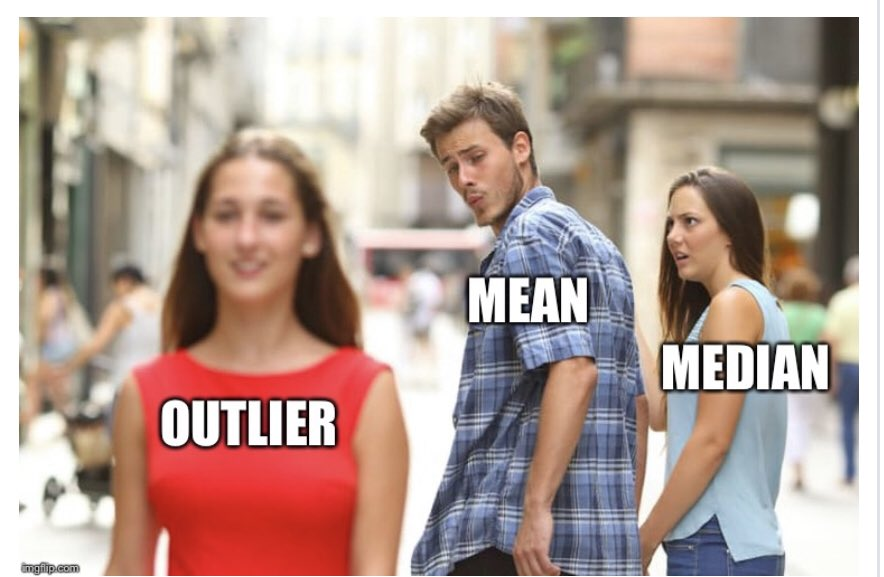

# Some announcements

## Exam 1 on February 15 (next Tuesday)

### Big and red scantron forms
### Pencil and eraser to fill in scantrons 
### Blank scratch paper
### Class-approved calculator
### One 8.5 х11 crib sheet (i.e., a concise set of notes, could be double-sided)

---

# Some announcements

## Big and red scantron forms

<center>

</center>

---

# What are we going to do?

## Recap to give you a big picture

### Central tendency & variability

### (Primers on the formula included)

## Group activity

## Q&A session

---

# Reflecting upon three weeks

## Fundamentals (statistics, variables)

## Some basic stat terms (population, parameter, sample, statistic)

## Focus on variables (type, measurement scale)

## Fiddling with variables (visualization, distribution)

---

# We are playing the game with the distribution

## Distribution
### An intuitive way to understand how the values of a variable are spread over

<br>

## We are interested in describing the distribution
### What would be efficient and informative ways?

---

# How to describe any distributions

## Measures of central tendency

### Reflect where 'values of a variable (i.e., distribution)' are centered

### **Mean**, median, and mode

## Measures of variability

### Reflect how much 'values of a variable (i.e., distribution)' are dispersed

### Range, deviation score, sum of squares, **variance**, **standard deviation**

---

# Primers on formula

## Notation

- Uppercase Roman letters that are usually near the end of the alphabet denote variables (e.g., $X$ and $Y$)

    - A numerical subscript represents an individual value of that variable (e.g., $X_{3}$ is the third value of the variable $X$)

- Greek letters are used represent population parameters (e.g., $\mu$, $\sigma^{2}$, $\sigma$)

- Roman letters are used to represent sample statistics (e.g., $\bar{X}$, $s^{2}$, $s$)

    - An alphabetical subcript represents the corresponding variables (e.g., $\sigma^2_{X}$, $s_{X}$)

- Lowercase $n$ denotes the sample size whereas the uppercase $N$ indicates the population size

---

# Primers on formula

## Notation

- $\Sigma$ (the uppercase Greek letter sigma) indicates the operation of summation (i.e., the addition of scores)

    -  $\Sigma_{i=1}^{5}X_{i} = X_{1}+X_{2}+X_{3}+X_{4}+X_{5}$

- Numerical exponents indicate multiplying that number itself multiple times

    - $X^{5} = X \times X \times X \times X \times X$

- (Positive) square root

    - $\sqrt{X^{2}} = (X^{2})^{\frac{1}{2}} = X$

- Summation and exponents combined

    - $\Sigma_{i=1}^{5}(X_{i}-\bar{X})^2 = (X_{1}-\bar{X})^2+(X_{2}-\bar{X})^2+(X_{3}-\bar{X})^2+(X_{4}-\bar{X})^2+(X_{5}-\bar{X})^2$
    $= (X_{1}-\bar{X})\times(X_{1}-\bar{X})+(X_{2}-\bar{X})\times(X_{2}-\bar{X})+...+(X_{5}-\bar{X})\times(X_{5}-\bar{X})$


---

# Central tendency

## Summary
|                               | Sample                     | Population          |
| :---------------------------- | :------------------------- | :---------------------------- |
| Mean                          | $\bar{X}=\frac{\sum_{i=1}^{n}X_{i}}{n}$ | $\mu_X=\frac{\sum_{i=1}^{N}X_{i}}{N}$ |
| Median                        | (When aranged) The $\frac{n+1}{2}$th value     | (When aranged) The $\frac{N+1}{2}$th value                 |
| Mode                          | The most frequent value           | The most frequent value           |

## Key ideas

- How these measures are related to distributions?
- Which measures are useful and when?
- Calculation

---

# Central tendency

.pull-left[
## Recall Positive Skewness
```{r posskew, message=FALSE, warning=FALSE, eval=FALSE}
set.seed(322)
x = rbeta(10000,2,5)
hist(x, main="Positive Skewness", freq=FALSE)
lines(density(x), col='blue', lwd=3)
abline(v = c(mean(x),median(x)),
       col=c("green", "red"),
       lty=c(2,2), lwd=c(3, 3))
```
- Trailing off toward the right end
- Mode < Median < Mean
- Score distribution of difficult exams
]

.pull-right[
```{r, ref.label="posskew", echo=FALSE}
```
]

---

# Central tendency

.pull-left[
## Recall Negative Skewness
```{r negskew, message=FALSE, warning=FALSE, eval=FALSE}
set.seed(322)
x = rbeta(10000,5,2)
hist(x, main="Negative Skewness", freq=FALSE)
lines(density(x), col='blue', lwd=3)
abline(v = c(mean(x),median(x)),
       col=c("green", "red"),
       lty=c(2,2), lwd=c(3, 3))
```
- Trailing off toward the left end
- Mean < Median < Mode
- Score distribution of easy exams
]

.pull-right[
```{r, ref.label="negskew", echo=FALSE}
```
]

---

# Central tendency

## Mean vs. median
### When **outliers** (i.e., extreme values) exist, consider using the median as a central tendency measure
### Imagine Elon Musk enters this room when we calculate our monthly income...

## Mode
### Useful for variables measured on nominal and ordinal scales
### Do you remember the distributional forms such as unimodal and bimodal?

---

# Central tendency

## Medians are resistant to the outliers... and hey means, don't be mean...

<center>

</center>

---

# Variability

## Range

$max - min$

## Deviation score

$X_{i}-\bar{X}$

## Sum of squares

$\Sigma_{i=1}^{n}(deviation\:score)^2=\Sigma_{i=1}^{n}(X_i-\bar{X})^2$

---

# Variability

## Variance

- Sample variance = $s^2 = \frac{\Sigma_{i=1}^{n}(deviation\:score)^2}{n-1} =  \frac{sum\:of\:squares}{n-1} =  \frac{\Sigma_{i=1}^{n}(X_{i}-\bar{X})^2}{n-1}$

- Population variance = $\sigma^2 = \frac{\Sigma_{i=1}^{N}(deviation\:score)^2}{N} =  \frac{sum\:of\:squares}{N} =  \frac{\Sigma_{i=1}^{N}(X_{i}-\mu_{X})^2}{N}$

## Standard deviation

- Sample standard deviation = $\sqrt{sample\:variance} = \sqrt{s^2} = s =  \sqrt{\frac{\Sigma_{i=1}^{n}(X_{i}-\bar{X})^2}{n-1}}$

- Population standard deviation = $\sqrt{population\:variance} = \sqrt{\sigma^2} = \sigma =  \sqrt{\frac{\Sigma_{i=1}^{N}(X_{i}-\mu)^2}{N}}$

---

# Variability

## Remember!

<center>

</center>

---

# Variability

## Some tips on interpreting the standard deviation

### **Average distance from the mean** <br> $\rightarrow$ Say, the average height of males in the Netherlands is 6 ft, and the standard deviation is 2.5 inches. What do these central tendency and variability measures mean?

### What if the standard deviation is zero?

---

# Central tendency and variability

## Summary
|                               | Sample                     | Population          |
| :---------------------------- | :------------------------- | :---------------------------- |
| Mean                          | $\bar{X}=\frac{\sum_{i=1}^{n}X_{i}}{n}$ | $\mu=\frac{\sum_{i=1}^{N}X_{i}}{N}$ |
|<br>     |         |                |
| Median                        | (When aranged) The $\frac{n+1}{2}$th value     | (When aranged) The $\frac{N+1}{2}$th value                 |
|<br>     |         |                |
| Mode                          | The most frequent value           | The most frequent value           |
|<br>     |         |                |
| Variance                      | $s^2=\frac{\Sigma_{i=1}^{n}(X_{i}-\bar{X})^2}{n-1}$ | $\sigma^2=\frac{\Sigma_{i=1}^{N}(X_{i}-\mu_{X})^2}{N}$ |
|<br>     |         |                |
| Standard deviation            | $s=\sqrt{\frac{\Sigma_{i=1}^{n}(X_{i}-\bar{X})^2}{n-1}}$ | $\sigma=\sqrt{\frac{\Sigma_{i=1}^{N}(X_{i}-\mu_X)^2}{N}}$ |

---

# Group activity

## Case study

David, a statistician at the United States Air Force, has collected the data on pilots' satisfaction with aviation training. With the data collected, his research team would like to evaluate the current training system and know how to improve it in the future. See the collected data following:

<center>
25, 35, 18, 20, 15, 5, 25, 10, 22, 25
</center>

## Can you answer below?
- What are the mean, the median, and the mode?
- What are the variance, and the standard deviation?
- What is the relative frequency of the score 25?
- What is the cumulative frequency of the score equal to 18 or lower?

---

# Q&A session

<center>

</center>

---

# Before you go home...

## Lab materials are available at

### https://github.com/IhnwhiHeo/PSY010

<br>

## Any questions or comments?

### Office hours or my email

---

# Thanks! Good luck with your exam!

<center>

</center>
