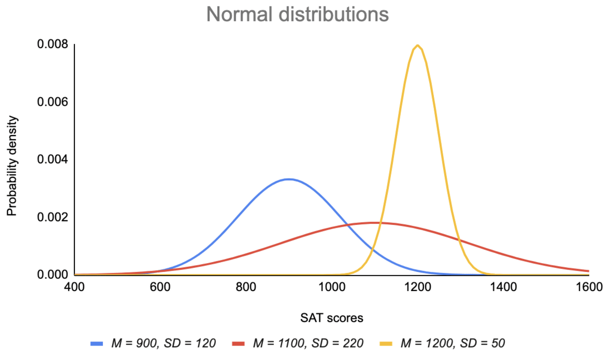
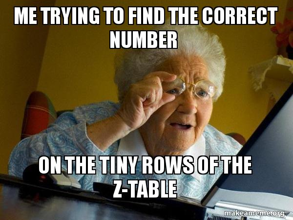
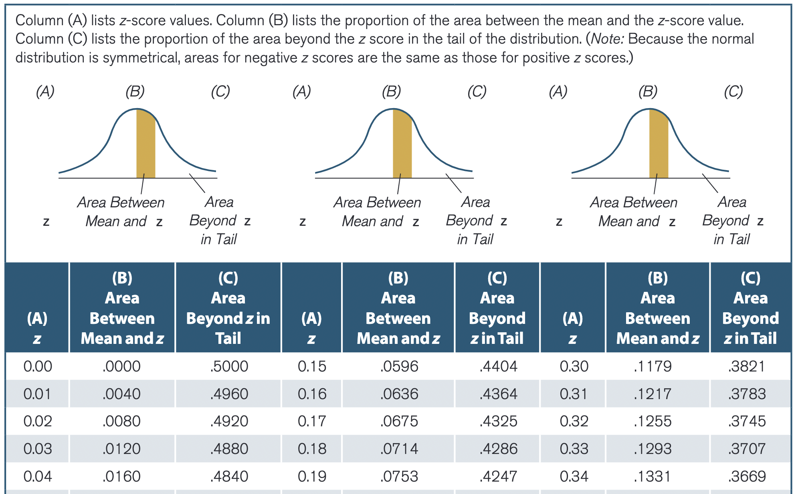

# What are we going to do?

## Recap to give you a big picture

### Probability

### Normal distribution and z-score

## Group activity

## (Optional) Reviewing exam 1

---

# Prelude

## In a couple of weeks, we do **inferential statistics** (aka. statistical inference)

## Statistical inference

### Let's make a best guess and test if that guess is true <br> $\rightarrow$ Estimation and hypothesis testing

## Statement of probability

### We speak of statistical inference in the statement of probability <br> (e.g., Hypothesis testing: what is the probability of obtaining a result that is as extreme as the one we have observed, if the hypothesis were true? $\rightarrow$ *p*-value)

---

# Probability

## Tells us how likely something is to happen
$\LARGE P(A)=\frac{\#\;of\;outcomes\;classified\;as\;A}{Total\;\#\;of\;possible\;outcomes}$

### When you flip a coin, what is the probability of the head?

### Say there are 5 candidates for the UC Merced student president election, and Giwon is one of the candidates. What is the probability that a vote goes for Giwon?

---

# Probability

.pull-left[
## Expressed as proportion <br> (area under the curve)
```{r example 1, message=FALSE, warning=FALSE, eval=FALSE}
# Generate data
set.seed(322)
x=seq(-4,4,length=200)
y=dnorm(x)
plot(x,y,type="l", lwd=2, col="blue",
     xlab="", ylab="")
x=seq(-4,1,length=200)
y=dnorm(x)
polygon(c(-4,x,1),c(0,y,0),col="gray")
```

- Imagine this is a distribution of scores
- Grey area is the probability that the score is 1 or below if we randomly pick one score
- Are you familiar with this distribution?

]

.pull-right[
```{r, ref.label="example 1", echo=FALSE}
```
]

---

# Normal distribution

.pull-left[
## How it looks like
```{r normal, message=FALSE, warning=FALSE, eval=FALSE}
set.seed(2093557522)
x = rnorm(10000,0,1)
hist(x, main="Normal Distribution", freq=FALSE, breaks=50)
lines(density(x), col='blue', lwd=3)
abline(v = c(mean(x),median(x)),
       col=c("green", "red"),
       lty=c(2,2), lwd=c(3, 3))
```
- Any continuous phenomenon that we would **normally** expect to observe
- Trailing off toward both left and right ends
- Bell-shaped & symmetrical around the **center**
- Mean = Median = Mode
- Gaussian distribution (in honor of Carl Friedrich Gauss)
]

.pull-right[
```{r, ref.label="normal", echo=FALSE}
```
]

---

# Normal distribution

## Normal distribution is determined by two factors

### Mean & standard deviation

<br>

## In theory, you can have infinite shapes of normal distributions

### Really? Can you believe it?

---

# Normal distribution

## Examples...

### What if we want to compare scores from different normal distributions...

<center>

</center>

---

# Z-score

## Why do we use the z-score?
### So far, we have played with the single distribution.

### We oftentimes want to compare values from **different normal distributions**!

---

# Z-score 

## How to calculate it?

### Population $\rightarrow \Large z = \frac{X-\mu}{\sigma}$

### Sample $\rightarrow \Large z = \frac{X-\bar{X}}{s}$

### If the variable is normally distributed, we can convert any value on that variable into a z-score!

---

# Z-score

## Interpretation

### How far certain values are from the mean (in standard deviation units)

- Say you have a z-score of 1.5. What does this mean?
- Say you have 4 z-scores (-7.0, 0.5, 2.3, and 6.5). Which score is the farthest from the mean?

---

# Z-score

## We know how to calculate the z-score and interpret it...

<br>

## What should you do next?

---

# Z-score

## OPEN YOUR EYES to see the Z-table...

<center>

</center>

---

# Z-score

## OPEN YOUR EYES to see the Z-table...

<center>

</center>

---

# Group activity

## Case study

Julia is interested in programming, so she took two programming courses in R and Python. Her achievement was excellent, but she is curious to compare her performances. In the R programming course, she scored 125 where the mean and the standard deviation are 80 and 18. In the Python programming course, she scored 92 where the mean and the standard deviation are 72 and 10. Assume that all scores are normally distributed.

## Can you answer below?
- What are the z-scores in each programming course? Can you interpret them?
- What is the percentage of students who did better than Julia in the Python programming course?
- What course did Julia showed a better achievement relative to her classmates?
- Say Ihnwhi also took the same R programming course, and his z-score is -0.25.
    - What would be Ihnwhi's raw score?
    - What is the percentage of students who did worse than Ihnwhi?
    - What is the percentage of students who scored between Julia and Ihnwhi?

---

# Before you go home...

## Lab materials are available at

### https://github.com/IhnwhiHeo/PSY010

<br>

## Any questions or comments?

### Office hours or my email

---

# Thanks! Have a good one!

<center>

</center>
