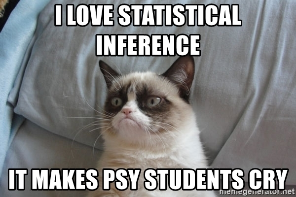

# Some announcements

## Homework 3 is due on March 8 (Tuesday)

### Don't forget to submit it on CatCourses

<br>

## Exam 2 is on March 17 (Thursday)

---

# What are we going to do?

## Recap to give you a big picture

### Sampling distribution of the mean

## Do it together

## Q&A session for homework 3

---

# Prelude

## From now onwards, we do **inferential statistics** (*aka.* **statistical inference**)

### Logic is crucial, so do not hesitate to ask me questions if anything is unclear!

### Let's prove ourselves against this grumpy cat!

<center>

</center>

---

# Statistical inference

## Main idea

### Let's make a best guess and test if that guess is true <br> $\rightarrow$ Estimation and hypothesis testing

## Where do we start?

### Let's assume we are interested in one sample statistic (e.g., a sample mean) <br> and have the distribution of all the possible sample statistics <br> $\rightarrow$ Sampling distribution

### In this course, we are mainly interested in **a sample mean** <br> $\rightarrow$ Sampling distribution of the mean

---

# Statistical inference

## Statement of probability

### We speak of statistical inference in the statement of probability <br> $\rightarrow$ If we have a normal distribution, we can calculate the area under the curve <br> (i.e., proportion, probability) using z-scores

<br>

## A closer look at the probability

### When you flip a coin, what is the probability of the head (or the front side)? <br> What if you saw three heads in a row during the first three tosses?

---

# Statistical inference

## Repeated sampling
### Probability is about after a large number of times
### As the number of trials (infinitely) increases, the average outcome converges to the expected probability ~~(frequentist statistics)~~

## Why important to take this into account?
### Helpful to understand the precise idea of frequentist statistical inference <br> (e.g., confidence interval, *p*-value)

---

# Statistical inference

## Remember...

### Let's make a best guess and test if that guess is true <br> $\rightarrow$ Estimation and hypothesis testing

<br>

## What are we interested in?

### We are interested in one sample mean <br> $\rightarrow$ We want to know the population mean using sample means <br> $\rightarrow$ Sampling distribution of the mean

---

# Central limit theorem

## Why important?

### We can apply probabilistic and statistical methods **that work for normal distributions** to problems involving other types of distributions

## Characteristics

### No matter what the original distribution looks like, the sampling distribution approximates a normal distribution if the sample sizes are larger enough

### Code from https://www.analyticsvidhya.com/blog/2019/05/statistics-101-introduction-central-limit-theorem/

---

# Central limit theorem

.pull-left[
## Your population is distributed as
```{r pop, eval=FALSE}
set.seed(322) # Replicability
dat <- rbeta(10000, 3, 25) # Data simulation
hist(dat, col ="lightblue", main="Population distribution", xlab = "Simulated data") # Plot a histogranm
```

## The population mean is 0.107.
]

.pull-right[
```{r, ref.label="pop", echo=FALSE}
```
]

---

# Central limit theorem

.pull-left[
## Collect a sample of 20 values, calculate the mean, and plot it... We repeat this 10000 times
```{r sam30, eval=FALSE}
set.seed(20210923) # Replicability
sample.20 <- c() # Empty vector
n=10000 # The number of iterations
for (i in 1:n) {
  sample.20[i] = mean(sample(dat,20, replace = TRUE))}
hist(sample.20, col ="lightblue", main="Sample size = 20",xlab = "Simulated data", xlim=c(0.07, 0.17))
abline(v = mean(sample.20), col = "Red")
```

## The mean is 0.107.
]

.pull-right[
```{r, ref.label="sam30", echo=FALSE}
```
]

---

# Central limit theorem

.pull-left[
## Collect a sample of 50 values, calculate the mean, and plot it... We repeat this 10000 times
```{r sam50, eval=FALSE}
set.seed(20210923) # Replicability
sample.50 <- c() # Empty vector
n=10000 # The number of iterations
for (i in 1:n) {
  sample.50[i] = mean(sample(dat,50, replace = TRUE))}
hist(sample.50, col ="lightblue", main="Sample size = 50",xlab = "Simulated data", xlim=c(0.07, 0.17))
abline(v = mean(sample.50), col = "Red")
```

## The mean is 0.107.
]

.pull-right[
```{r, ref.label="sam50", echo=FALSE}
```
]

---

# Central limit theorem

.pull-left[
## Collect a sample of 500 values, calculate the mean, and plot it... We repeat this 10000 times
```{r sam500, eval=FALSE}
set.seed(20210923) # Replicability
sample.500 <- c() # Empty vector
n=10000 # The number of iterations
for (i in 1:n) {
  sample.500[i] = mean(sample(dat,500, replace = TRUE))}
hist(sample.500, col ="lightblue", main="Sample size = 500",xlab = "Simulated data", xlim=c(0.07, 0.17))
abline(v = mean(sample.500), col = "Red")
```

## The mean is 0.107.
]

.pull-right[
```{r, ref.label="sam500", echo=FALSE}
```
]

---

# Sampling distribution of the mean

## What is it?

### A distribution of the sample means (i,e., collection of the means of possible samples)

<br>

## What can we do?

### Use the z-table since the sampling distribution is **normally distributed**

### Calculate the probability of getting any specific mean from a random sample

---

# Sampling distribution of the mean

## Sampling error

### Deviation of the (each) sample mean from the population mean

$\huge \mu_{\bar{X}}-\mu$

---

# Sampling distribution of the mean

## Standard error of the mean

### Standard deviation of the sampling distribution of the mean (spread of sampling error)

### Typical distance that a sample mean deviates from the population mean

$\huge \sigma_{\bar{X}}=\frac{\sigma}{\sqrt{n}}$

---

# Sampling distribution of the mean

## Is normally distributed with...

### Mean

$\huge \mu_{\bar{X}} = \mu$

### Standard deviation

$\huge \sigma_{\bar{X}}=\frac{\sigma}{\sqrt{n}}$

---

# Sampling distribution of the mean

## Some tips

### Be careful which area under the curve (i.e., proportion, probability) is needed before looking at the z-table

### Be careful whether you are using a raw score or a sample mean

---

# Do it together

## Q13 in HW3

### A researcher records the following response times (in seconds) to a visual stimulus. Assuming these data are normally distributed, N(23, 3.1), what is the probability that participants responded in 20 seconds or less? (Note. round z score to 2 decimal places.)

### - .1660 <br> - .6660 <br> - The probability is not listed in the unit normal table. <br> - .3340

---

# Do it together

## Q19 in HW3

### A researcher selects a sample of 49 participants from a population with a mean of 12 and a standard deviation of 3.5. What is the probability of selecting a sample mean of 13 or larger from this population?

### - equal to the probability of selecting a score above the mean <br> - greater than .31 <br> - about one standard deviation below the mean <br> - less than .03

---

# Q&A session for homework 3

<center>

</center>

---

# Before you go home...

## Lab materials are available at

### https://github.com/IhnwhiHeo/PSY010

<br>

## Any questions or comments?

### Office hours or my email

---

# Thanks! Have a good one!

<center>

</center>
