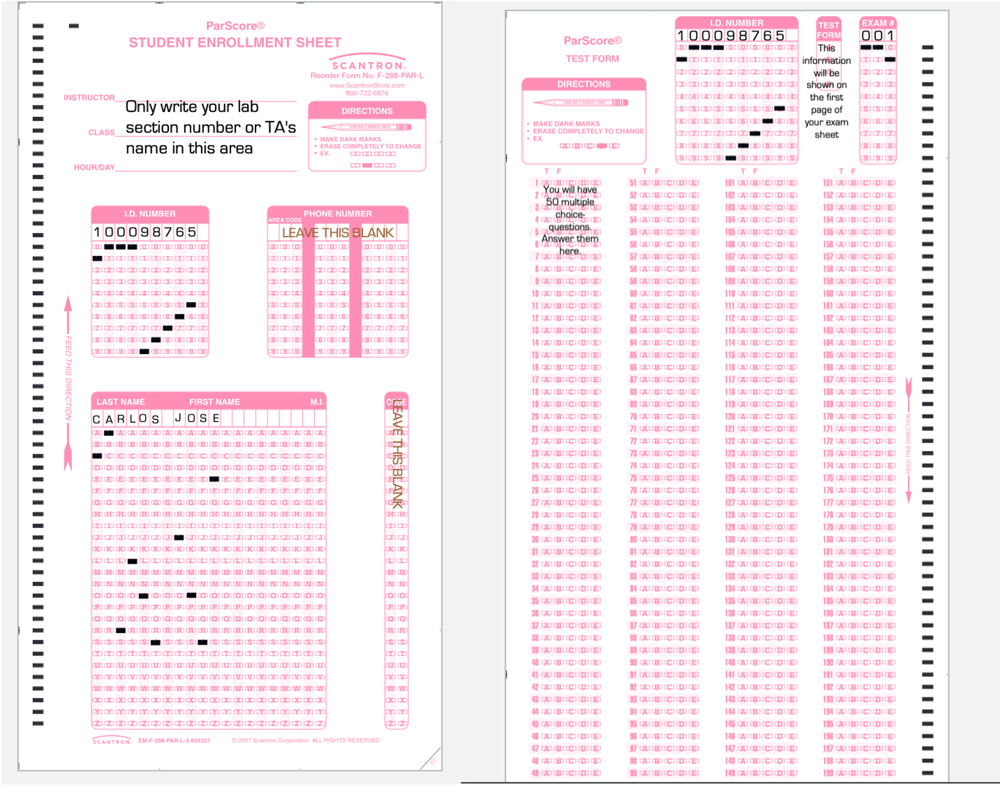

# Some announcements

## Homework 4 is due on March 15 (next Tuesday)

### Don't forget to submit it on CatCourses

## We don't have a lab on March 16 (next Wednesday)

### Spend your time studying Exam 2

## Exam 2 is on March 17 (next Thursday)

### You know what to prepare for... right?

---

# Some announcements

## Exam 2 is on March 17 (next Thursday)

### **Big and red scantron forms**
### Pencil and eraser to fill in scantrons 
### Blank scratch paper
### Class-approved calculator
### One 8.5 х11 crib sheet (i.e., a concise set of notes, could be double-sided)

---

# Some announcements

## Big and red scantron forms

---

# What are we going to do?

## Recap to give you a big picture

### Hypothesis testing

### Z-test

### ...and a bit more for your exam (power, effect size)

## Do it together

## Q&A session for homework 4

---

# Statistical inference

## Idea 1

### Let's make a best guess about the population parameter and test if that guess is true  $\rightarrow$ Estimation and hypothesis testing  $\rightarrow$ Our best guess is a sample mean (estimation), and let's test the probability of observing this sample mean or more extreme if the null hypothesis were true (hypothesis testing)

## Idea 2

### Let's assume we are interested in one sample mean and have the distribution of all the possible sample means  $\rightarrow$ Sampling distribution of the mean

---

# Hypothesis testing

## In a nutshell

### A form of statistical inference to draw conclusions about population parameters using sample statistics (e.g., sample means)

### How science is conducted and advanced

### One of my research interests is Bayesian hypothesis testing

### But... we learn frequentist hypothesis testing,  *a.k.a.*, **Null Hypothesis Significance Testing (NHST)** :)

---

# Hypothesis testing

## From now on, let me explain a general procedure to you

### Step 1. State null and alternative hypothesis (from your research question)

### Step 2. Select the level of significance, i.e., $\alpha$

### Step 3. Compute the test statistic (e.g., z-statistic)

### Step 4. Make a statistical decision $\rightarrow$ reject or not reject the null hypothesis

---

# Step 1. State null and alternative hypothesis

## Definition of a hypothesis

### Given an observation, a phenomonen, or a scientific problem,  a statement or proposed explanation about the value for a population parameter

 

## Null Hypothesis Significance Testing

### We need a null hypothesis and an alternative hypothesis

---

# Step 1. State null and alternative hypothesis

### Start from your research question   "Are UC Merced students friendlier than most other people?"

### **Null hypothesis** $\rightarrow$ nothing is going on; we want to reject this!

### $H_{0}$: UC Merced students are equally as friendly as or less friendly than most other people $\rightarrow\mu_{UCM}\le\mu_{other\:people}$

### **Alternative hypothesis** $\rightarrow$ something is going on; we hope to retain this!

### $H_{1}$: UC Merced students are more friendlier than most other people $\rightarrow\mu_{UCM}>\mu_{other\:people}$

---

# Step 1. State null and alternative hypothesis

## Depending on research questions, alternative hypotheses can be...

### Directional: expect one group might be greater or less than the other $\rightarrow$ one-tailed
- Is the height of giraffes bigger than polar bears?
  - $H_{0}:\mu_{giraffes}\le\mu_{polar\:bears}$
  - $H_{1}:\mu_{giraffes}>\mu_{polar\:bears}$

### Non-directional: focus on only whether there are differences $\rightarrow$ two-tailed
- Does playing music when studying have a different effect on concentration than without music?
  - $H_{0}:\mu_{music}=\mu_{no\:music}$
  - $H_{1}:\mu_{music}\neq\mu_{no\:music}$

---

# Step 2 & 3. Select $\alpha$ and compute the test statistic

## Go back to our example
### Say we found that the mean friendliness score was much higher among UC Merced students (Mean = 130) compared to the score in other people (Mean = 100)

## To compare these means...

### Select the level of significance, i.e., $\alpha$, which is usually .05 (5%)

### Compute the test statistic and obtain the *p*-value   $\rightarrow$ If we know the population standard deviation, we use a z-statistic

---

# Step 4. Make a statistical decision

## Say our *p*-value is .03

### There is a 3% chance of getting our sample mean (or more extreme) if the null hypothesis were true (We can still get this sample mean if the null hypothesis is true!)

  

## Note that we usually set $\alpha$ to .05

### Very common in psychology

---

# Step 4. Make a statistical decision

## If our *p*-value is lower than $\alpha$, we reject the null hypothesis!!!
$H_{0}$: UC Merced students are equally as friendly as or less friendly than most other people $\rightarrow\mu_{UCM}\le\mu_{other\:people}$

$H_{1}$: UC Merced students are more friendlier than most other people $\rightarrow\mu_{UCM}>\mu_{population}$

---

# Step 4. Make a statistical decision

## Wait! Revisit statistical decisions...

### Danniela found that UC Merced students are friendlier. However, **what if UC Merced students are actually not friendlier?**

### Emerald found that UC Merced students are not friendlier. However, **what if UC Merced students are actually friendlier?**

 
## These imply that there can be errors in statistical decision making

---

# Type I error

## Rejecting the null hypothesis when it is true

### Type I error rate is the alpha (i.e., $\alpha$)

## False positive
### We think we detected an effect, but in reality, there is not

## Example?
- An allergy test says you are allergic to cats, but you are not. As a consequence, you do not adopt a cat.
- Convict an innocent person of a crime

---

# Type II error

## Failing to reject the null hypothesis when it is false

### Type II error rate is the beta (i.e., $\beta$)

## False negative
### We did not detect an effect, but in reality, there is

## Example?
- An allergy test doesn't detect any cat allergy, but you are actually allergic to cats. So, you get sick after the adoption.
- Fail to convict a criminal of a crime

---

# Type I and II errors

## Great... now we know both types of errors

## But... we want a correct decision instead of committing errors

---

# Power

---

# Power

## The probability of rejecting the null hypothesis when it is false = $1-\beta$

### R Shiny App: https://rpsychologist.com/d3/nhst/

---

# Power

.pull-left[
## Power **increases** when...
### Larger sample sizes
### Larger effect sizes
### Smaller spread
### Larger alpha level
### One-tailed test
]

.pull-right[
## Power **decreases** when...
### Smaller sample sizes
### Smaller effect sizes
### Larger spread
### Smaller alpha level
### Two-tailed test
]

---

# Effect size

## Motivation
### Researchers are down to reject the null hypothesis
### Say, we have a *p*-value lower than the $\alpha$ level (e.g., 0.05) $\rightarrow$ Statistical significance
### Do statistically significant results tell you how much the effects are?

---

# Effect size

## Idea
### Quantify the magnitude of the effect
### Example: mean differences, strength of the relationships, ...

## Implication
### While we can reject the null hypothesis, the effect can be either small or large!

---

# Many statistical techniques for hypothesis testing

## z-test, t-test, ANOVA, ANCOVA, MANOVA, MANCOVA, RM-ANCOVA... WHAT?!

### Playing the game of statistical inference about population 'means'

---

# Z-test

## What does it test?

### Whether a sample mean is different from a specified population mean

### Remember our Step 1: State null and alternative hypothesis

 

## But, when?

### We know the population mean and population standard deviation (VERY IDEAL!)

---

# Z-test

## Idea

### We do hypothesis testing (remember Step 1 through Step 4)

### In Step 3, when computing test statistic, we calculate a **z-statistic** when we know $\mu$ and $\sigma$

$\LARGE z=\frac{\overline{X}-\mu}{\frac{\sigma}{\sqrt{n}}}$

## Are you familiar with this formula?

---

# Z-test

## When doing hypothesis, our Step 4 is to make a statistical decision

### See if our *p*-value is lower than $\alpha$

 

## This is equivalent to say...

### $|z_{obt}| > |z_{crit}|$

### In case of z-test, $|z_{crit}|$ is **1.645** for one-tailed test and **1.96** for two-tailed test

---

# Z-test

## Effect size

### If we find statistical significance, we quantify the size of the effect
### Means how many standard deviations (SDs) the sample mean lies from the population mean

 
## In z-test, the effect size is calculated as

$\LARGE d=\frac{\overline{X}-\mu}{\sigma}$

---

# Thoughts on hypothesis testing

## A black bear story from a famous Dutch statistician!

### https://www.youtube.com/watch?v=Dqm1vqk8TC0

---

# Trailer

## Some critical thoughts on NHST

### Say we fail to reject the null hypothesis. Does this mean the alternative hypothesis is wrong?

### Say our *p*-value is .051 whereas $\alpha$ is .05. Would it be reasonable to say there is not enough evidence to reject the null hypothesis?

### Note that journals love *p*-values lower than .05 ONLY... is it fair?

---

# Do it together

## Q17 in HW4

### A professor finds that the average SAT score among all students attending his college is 1150 (sigma = 150). He polls his class of 25 students and finds that the average SAT score is 1,200. Suppose he computes a z test at a .05 level of significance. What is his decision?

### - to reject the null hypothesis for a two-tailed test, but to retain the null hypothesis for an one-tailed test   - to reject the null hypothesis for an one-tailed test, but to retain the null hypothesis for a two-tailed test   - to retain the null hypothesis   - to reject the null hypothesis

---

# Q&A session for homework 4

---

# Before you go home...

## Lab materials are available at

### https://github.com/IhnwhiHeo/PSY010

 

## Any questions or comments?

### Office hours or my email

---

# Thanks! Have a good one!

