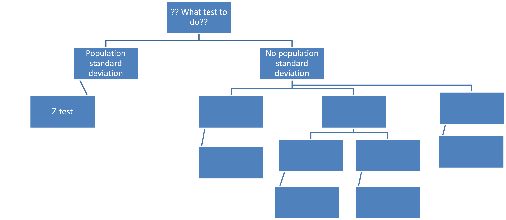
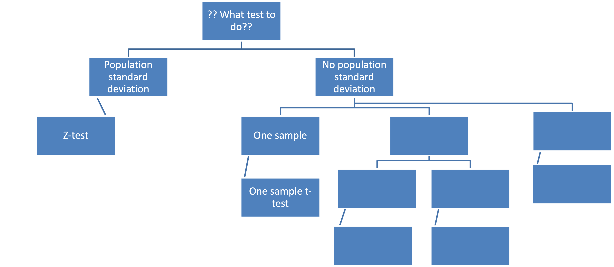

# Some announcements

## Syllabus has been updated (see CatCourses)

### No class on April 28

### Extra credit assignments on April 21 & April 28

### Use this opportunity to boost your GPA!!!

---

# What are we going to do?

## Recap to give you a big picture

### One-sample t-test

 

## Do it together

---

# Where are we now?

## Fundamentals of statistics

### Basic terms: parameter, statistic, variable, measurement scale

## Data visualization

### Bar chart, pie chart, frequency table, histogram, distribution

## Statistical inference

### Estimation, hypothesis testing, z-test

---

# Statistical inference

## Estimation

### Let's make a best guess about the population parameter

### Point estimate and interval estimate

## Hypothesis testing

### Let's test if our guess is really the case or not

### Reject the null hypothesis when *p*-value $<$ $\alpha$-level $\Longleftrightarrow$ $|z_{obt}| > |z_{crit}|$

---

# Are you ready?

## z-test, t-test, ANOVA, ANCOVA, MANOVA, MANCOVA, RM-ANCOVA... WHAT?!

### Playing the game of statistical inference about population 'means'

---

# Recap: z-test

## Idea

### We have a sample mean (estimation)

### When we know the population mean and standard deviation, we test if the likelihood of observing our sample mean or more extreme is significantly low (hypothesis testing)

## How do you think?

### Is it realistic?

---

# Big picture

---

# T-test

## Student's t-distribution vs. teacher's t-distribution

### William Sealy Gosset at Guinness Brewery

---

# T-test

## Idea

### Still interested in population means from either one sample or two samples (independent vs. related)

 

## But, when?

### We know the population mean but not the population standard deviation (MORE REALISTIC!)

---

# T-test

## Degrees of freedom (df)
### # of independent pieces of information # of values that are free to vary in a data set
### Determines the shape of the t-distributions (i.e., df is the parameter of the t-distribution)
### One-sample t-test = $n − 1$

---

# One-sample t-test

## Idea

### We have a single sample mean (estimation) and want to test the likelihood of observing this sample or more extreme if the null hypothesis were true (hypothesis testing)

### In doing estimation and hypothesis testing, we have made a sampling distribution of the mean. Now, let's quantify how close/far our sample mean is from our expectation

---

# Big picture

---

# Do it together

## Say we are interested in knowing whether this class's ratings of Pavilion food differs from the rest of the UC population. The average rating of Pavilion food is 50 (out of 100), and we do not have any information about the standard deviation in the population. Use the $\alpha$-level of .05.

 

## Which statistical technique should we use? Why?

---

# Do it together

## Step 1. State the null hypothesis and alternative hypothesis

### $H_0: \mu =$
### $H_1: \mu \neq$

 

## Can you understand why this is a two-tailed situation?

---

# Do it together

## Step 2. Set the level of significance

### $\alpha =$

---

# Do it together

## Step 3. Compute the test-statistic (in this case, t-statistic)

### $\LARGE t_{obt} = \frac{\bar{X} - \mu}{\frac{s}{\sqrt{n}}} =$

---

# Do it together

## Step 4. Make a statistical decision

### Reject $H_0$ if *p*-value $<$ $\alpha$   $\Longleftrightarrow$ $|t_{obt}| > |t_{crit}|$

### We need to see the t-table

### What is the degrees of freedom for one-sample t-test?

### $n-1$

---

# Do it together

## Step 4. Make a statistical decision

### Find a correct critical t-value

### https://catcourses.ucmerced.edu/courses/23514/files/4944724?module_item_id=297542

### See if $|t_{obt}| > |t_{crit}|$

### What is our decision?

---

# Do it together

## Additional steps

### Calculate the effect size (meaningful if significant)

### Calculate the confidence interval

---

# Do it together

## Additional step 1. Effect size

### $\LARGE d = \frac{\bar{X}-\mu}{s} =$

### How to interpret?

### Our sample mean is ~~~ standard deviation units above/below the population mean

### Small (0.2)? Medium (0.5)? Large (0.8)?

---

# Do it together

## Additional step 2. Confidence interval

### Lower limit: $\Large \bar{X}_{obt} - \frac{s}{\sqrt{n}} \times t_{crit}$

### Upper limit: $\Large \bar{X}_{obt} + \frac{s}{\sqrt{n}} \times t_{crit}$

### Does the confidence interval contain the population mean?

### What does this confidence interval mean?

---

# Stop misusing *p*-values!

### Prof. Dr. Rens van de Schoot (https://www.youtube.com/watch?v=JRY2krxYwso)

<iframe width="672" height="378" src="https://www.youtube.com/embed/JRY2krxYwso" title="YouTube video player" frameborder="0" allow="accelerometer; autoplay; clipboard-write; encrypted-media; gyroscope; picture-in-picture" allowfullscreen></iframe>

---

# Before you go home...

## Lab materials are available at

### https://github.com/IhnwhiHeo/PSY010

 

## Any questions or comments?

### Office hours or my email

---

# Thanks! Have a good one!

