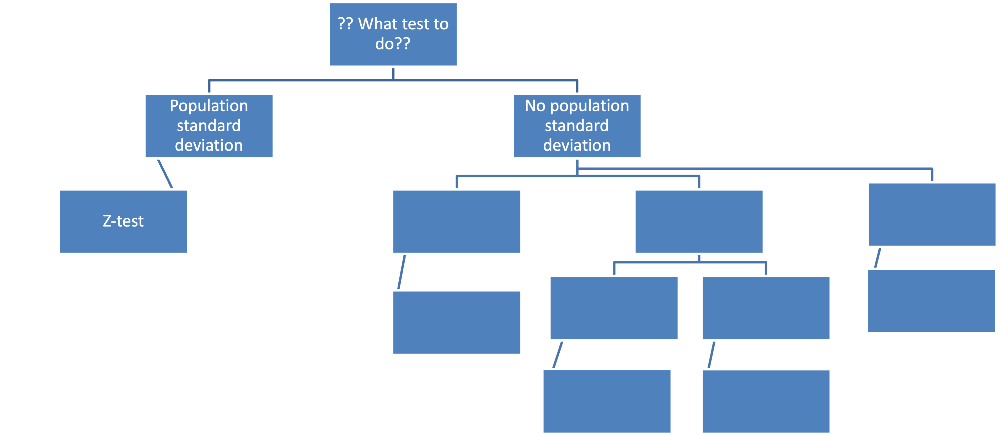
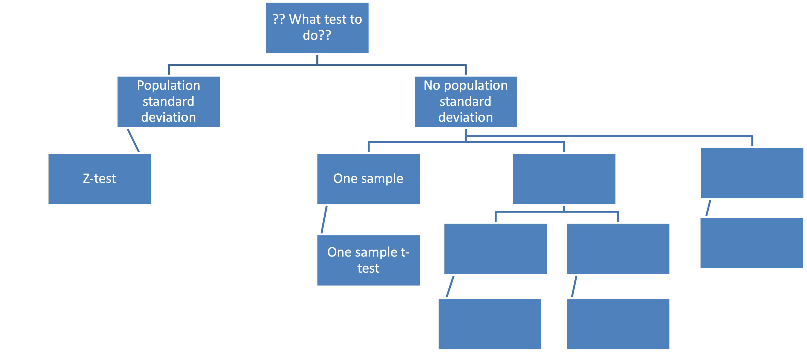

# Some announcements

## Syllabus has been updated (see CatCourses)

### No class on April 28

### Extra credit assignments on April 21 & April 28

### Use this opportunity to boost your GPA!!!

## Homework 5

### Will be available tomorrow $\Longrightarrow$ Get my help!

---

# What are we going to do?

## Recap to give you a big picture

### Independent-sample t-test

### Related-sample t-test

 

## Do it together

---

# Statistical inference

## Estimation

### Let's make a best guess about the population parameter

### Point estimate and interval estimate

## Hypothesis testing

### Let's test if our guess is really the case or not

### Reject the null hypothesis when   *p*-value $<$ $\alpha$-level $\Longleftrightarrow$ $|z_{obt}| > |z_{crit}|$ $\Longleftrightarrow$ $|t_{obt}| > |t_{crit}|$

---

# Are you ready?

## z-test, t-test, ANOVA, ANCOVA, MANOVA, MANCOVA, RM-ANCOVA... WHAT?!

### Playing the game of statistical inference about population 'means'

---

# Recap: z-test

## Idea

### We have a sample mean (estimation)

### When we know the population mean and standard deviation, we test if the likelihood of observing our sample mean or more extreme is significantly low (hypothesis testing)

## Test-statistic

$\LARGE z_{obt}=\frac{\overline{X}-\mu}{\frac{\sigma}{\sqrt{n}}}$

---

# Big picture

---

# Recap: one-sample test

## Idea

### We have one sample mean (estimation)

### When we only know the population mean, we test if the likelihood of observing our sample mean or more extreme is significantly low using sample standard deviation (hypothesis testing)

## Test-statistic

$\LARGE t_{obt} = \frac{\bar{X} - \mu}{\frac{s}{\sqrt{n}}}$

---

# Big picture

---

# Independent-sample t-test

## "Independent-sample"...

### What is it?

---

# Independent-sample t-test

## What does it test?
### To compare two samples whether they are different from each other

## Note
### We use the t-distribution based on df of $n_1 + n_2 - 2$

## But, when?
### We know the population mean but not the population standard deviation

---

# Big picture

---

# Do it together

## Rosimary, a chief school psychologist at Harvard University, conducts an experiment to study the effect of a newly invented study program on academic achievement. She assigns participants into two groups: experimental and control. In each group, there are 50 people. In the population, it is known that the means of academic achievement are the same between the two groups. After the program, it is observed that the means of academic achievement are 80 for the experimental group and 50 for the control group. Use the $\alpha$-level of .05.

## Which statistical technique should we use? Why?

---

# Do it together

## Step 1. State the null hypothesis and alternative hypothesis

### $H_0: \mu_1 = \mu_2$
### $H_1: \mu_1 \neq \mu_2$

---

# Do it together

## Step 2. Set the level of significance

### $\alpha =$

---

# Do it together

## Step 3. Compute the test-statistic (in this case, t-statistic)

### $\large t_{obt} = \frac{(\bar{X_1} - \bar{X_2}) - (\mu_1 - \mu_2)}{s_{\bar{X_1} - \bar{X_2}}} =$  where   $\large s_{\bar{X}_1-\bar{X}_2}=\sqrt{\frac{s^2_p}{n_1}+\frac{s^2_p}{n_2}} =$   where   $\large s^2_p=\frac{s^2_1(df_1)+s^2_2(df_2)}{n_1+n_2-2} = \frac{s^2_1(n_1-1)+s^2_2(n_2-1)}{n_1+n_2-2}=\frac{SS_1+SS_2}{n_1+n_2-2} =$

---

# Do it together

## Step 4. Make a statistical decision

### Reject $H_0$ if *p*-value $<$ $\alpha$   $\Longleftrightarrow$ $|t_{obt}| > |t_{crit}|$

### We need to see the t-table

### What is the degrees of freedom for the independent-sample t-test?

### $n_1 + n_2 - 2$

---

# Do it together

## Step 4. Make a statistical decision

### Find a correct critical t-value

### https://catcourses.ucmerced.edu/courses/23514/files/4944724?module_item_id=297542

### See if $|t_{obt}| > |t_{crit}|$

### What is our decision?

---

# Do it together

## Additional steps

### Calculate the effect size (meaningful if significant)

### Calculate the confidence interval

---

# Do it together

## Additional step 1. Effect size

### $\LARGE d = \frac{\bar{X}_1-\bar{X}_2}{s_p} =$

### How to interpret?

### Our sample mean is ~~~ standard deviation units above/below the population mean difference

### Small (0.2)? Medium (0.5)? Large (0.8)?

---

# Do it together

## Additional step 2. Confidence interval

### Lower limit: $\Large (\bar{X}_1-\bar{X}_2) - s_{\bar{X}_1-\bar{X}_2} \times t_{crit}$

### Upper limit: $\Large (\bar{X}_1-\bar{X}_2) + s_{\bar{X}_1-\bar{X}_2} \times t_{crit}$

### Does the confidence interval contain the population mean difference?

### What does this confidence interval mean?

---

# Related-sample t-test

## "Related-sample"...

### What is it?

---

# Related-sample t-test

## What does it test?
### To compare two samples whether they are different from each other

## Note
### We use the t-distribution based on df of $n-1$

## But, when?
### We know the population mean but not the population standard deviation

---

# Big picture

---

# Do it together

## Mireya, a biological scientist at Stanford University, conducts an experiment to study if the level of happiness has changed between February and April. From 100 participants, she repeatedly measured the level of happiness in February and April. In the population, it is known that the mean level of happiness is the same between two months. In her sample, it is observed that the mean happiness in February is 50 and that in April is 80. Use the $\alpha$-level of .05.

## Which statistical technique should we use? Why?

---

# Do it together

## Step 1. State the null hypothesis and alternative hypothesis

### $H_0: \mu_1 = \mu_2$
### $H_1: \mu_1 \neq \mu_2$

---

# Do it together

## Step 2. Set the level of significance

### $\alpha =$

---

# Do it together

## Step 3. Compute the test-statistic (in this case, t-statistic)

### $\large t_{obt} = \frac{\bar{D}_{obt}-\mu_D}{\frac{s_D}{\sqrt{n}}}$

---

# Do it together

## Step 4. Make a statistical decision

### Reject $H_0$ if *p*-value $<$ $\alpha$   $\Longleftrightarrow$ $|t_{obt}| > |t_{crit}|$

### We need to see the t-table

### What is the degrees of freedom for the independent-sample t-test?

### $n-1$

---

# Do it together

## Step 4. Make a statistical decision

### Find a correct critical t-value

### https://catcourses.ucmerced.edu/courses/23514/files/4944724?module_item_id=297542

### See if $|t_{obt}| > |t_{crit}|$

### What is our decision?

---

# Do it together

## Additional steps

### Calculate the effect size (meaningful if significant)

### Calculate the confidence interval

---

# Do it together

## Additional step 1. Effect size

### $\LARGE d = \frac{\bar{D}_{obt}}{s_{D}} =$

### How to interpret?

### Our sample mean is ~~~ standard deviation units above/below the population difference score

### Small (0.2)? Medium (0.5)? Large (0.8)?

---

# Do it together

## Additional step 2. Confidence interval

### Lower limit: $\Large \bar{D}_{obt} - s_{\bar{D}} \times t_{crit}$

### Upper limit: $\Large \bar{D}_{obt} + s_{\bar{D}} \times t_{crit}$

### Does the confidence interval contain the population difference score?

### What does this confidence interval mean?

---

# Before you go home...

## Lab materials are available at

### https://github.com/IhnwhiHeo/PSY010

 

## Any questions or comments?

### Office hours or my email

---

# Thanks! Have a good one!

