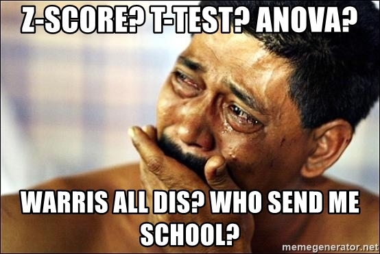
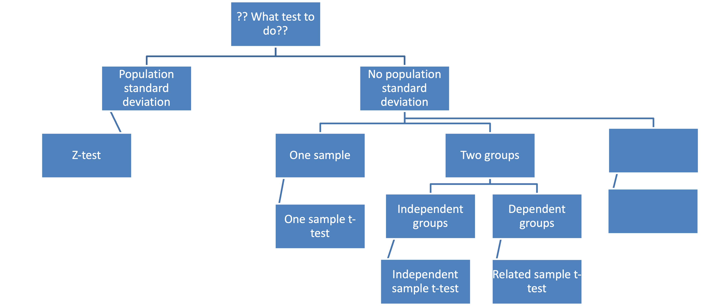

# Some announcements

## Syllabus has been updated (see CatCourses)

### No class on April 28

### Extra credit assignments on April 21 & April 28

### Use this opportunity to boost your GPA!!!

## Homework 5

### Due April 19

---

# What are we going to do?

## Recap to give you a big picture

### One-Way ANOVA

 

## Do it together

---

# Statistical inference

## Estimation

### Let's make a best guess about the population parameter

## Hypothesis testing

### Let's test if our guess is really the case or not

### Reject the null hypothesis when   *p*-value $<$ $\alpha$-level   $\Longleftrightarrow$ $|z_{obt}| > |z_{crit}|$ $\Longleftrightarrow$ $|t_{obt}| > |t_{crit}|$ $\Longleftrightarrow$ $F_{obt} > F_{crit}$

---

# Are you ready?

## z-test, t-test, ANOVA, ANCOVA, MANOVA, MANCOVA, RM-ANCOVA... WHAT?!

### Playing the game of statistical inference about population 'means'

---

# Big picture

---

# A gentle introduction to ANOVA

## So far, we've only compared one group or two groups

### z-test, one-sample t-test, independent-sample t-test, related-sample t-test

 

## What if we have three groups?   (e.g., Merced College, UC Merced, Merced High School)

### ANOVA (= Analysis of Variance)

---

# A gentle introduction to ANOVA

## Variables

### So far, we think of our variables as different groups

### For ANOVA, think of our variables as multiple levels of the same variable

## That is,

### Instead of comparing Merced College vs. UC Merced vs. Merced High School

### We have 'school type' as the independent variable (*aka*. factor in ANOVA context)

### The 'school type' has 3 levels: Merced College, UC Merced, and Merced High School

---

# One-way ANOVA

## 'N-Way': N = the number of IV (or factor)

### One-way ANOVA: ANOVA using one IV; factorial ANOVA: 2 or more IV

---

# One-way ANOVA

## Hypotheses in ANOVA

### Assuming there are three groups (Merced College, UC Merced, Merced High School)

### Null hypothesis ( $H_0$)

$\LARGE \mu_{MC} = \mu_{UCM} = \mu_{MHS}$ $\Longleftrightarrow$ $\LARGE \sigma_{\mu}^{2}=0$

### Alternative hypothesis ( $H_1$)

### At least one pair has a different mean $\Longleftrightarrow$ $\sigma_{\mu}^{2}>0$

---

# One-way ANOVA

## F-ratio

### Test-statistic for ANOVA

### The ratio between the between group-variability and within-group variability

### Larger F-ratio $\rightarrow$ larger portion of between-group variability compared to within-group variability

$\LARGE F_{obt} = \frac{\frac{SS_{between}}{df_{between}}}{\frac{SS_{within}}{df_{within}}} = \frac{MS_{between}}{MS_{within}}$

---

# One-way ANOVA

## 'Variance' is the key, and do you remember that SS plays a role in variance?

### Population variance and sample variance
$\LARGE \sigma^2=\frac{\Sigma_{i=1}^{N}(X_i-\mu_{X})^2}{N}$ and $\LARGE s^2=\frac{\Sigma_{i=1}^{n}(X_i-\bar{X})^2}{n-1}$

 

## Can you find SS and df?

---

# One-way ANOVA

## We 'separate' the between-group variance and within-group variance

### In terms of SS

$\LARGE SS_{total}=SS_{between}+SS_{within}$

### In terms of df

$\LARGE df_{total} = df_{between} + df_{within}$   $\LARGE N-1 = (k-1) + (N-k)$

---

# One-way ANOVA

## Mean squares $\rightarrow$ What does it look like?!?!

$\LARGE MS_{between}=\frac{SS_{between}}{df_{between}}$

$\LARGE MS_{within}=\frac{SS_{within}}{df_{within}}$

## Finally, F-ratio $\rightarrow$ Compare this to the critical F-ratio

$\LARGE F_{obt} (df_{between},\:\:df_{within}) = \frac{MS_{between}}{MS_{within}}$

---

# One-way ANOVA

## Filling in the table

---

# Big picture

---

# One-way ANOVA

## Effect size (eta-squared)

### $\LARGE \eta^2 = \LARGE \frac{SS_{between}}{SS_{total}}$

### Magnitude of the between group effect

### ~~% of the variance in the DV is explained by the IV

### You can also use $\omega^2$ (omega-squared)...

---

# One-way ANOVA

## Between-subjects factor $\rightarrow$ Between-subject ANOVA

### Factor separates groups of **different** individuals

### Each score comes from a different subject

## Example?

### Clinical therapy (behavioral, cognitive, control)

### Place of birth (California, Oregon, Florida, Arizona)

---

# One-way ANOVA

## Within-subjects factor $\rightarrow$ Within-subject ANOVA

### Factors separate multiple measures within the **same** individuals

### Each subject provides scores under multiple conditions/timepoints

## Example?

### Time (measurements at time 1, time 2, and time 3)

### Repeated measurements in general!

---

# Do it together

## Questions about homework 5?

---

# Before you go home...

## Lab materials are available at

### https://github.com/IhnwhiHeo/PSY010

 

## Any questions or comments?

### Office hours or my email

---

# Thanks! Have a good one!

