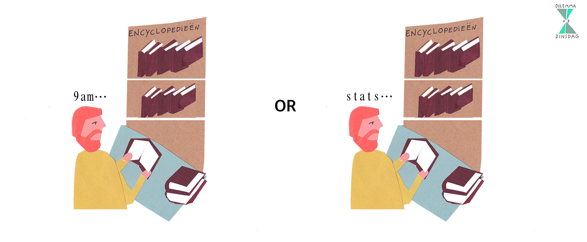

# Who am I?
## Ihnwhi Heo, M.Sc.

.pull-left[
### Background/Interests in
- Methodology and Statistics
- Psychology
- Bayesian inference

]

.pull-right[
### Trivia
- Traveled to 26 countries
- Served in the Air Force
- Fan of musicals & Marvel Studios
- Pineapples does not go on pizza

]

---

# What are we going to do?

## Breaking the ice: Dilemmas on Friday

## How to be successful in lab sessions

## Recap to give you a big picture

## Group activity

---

# Dilemmas on Friday

## Dilemmas op dinsdag

.pull-left[
There is a chocolate river through your garden.
]

.pull-right[
All the animals do everything you say.
]

---

# Dilemmas on Friday

## Dilemmas op dinsdag

.pull-left[
Every psychology course is taught at 9 am.
]

.pull-right[
Every psychology course focuses on statistics.
]

---

# How to be successful

## Purpose
Provide extra exposure to statistical concepts and practice problems

## What can you expect from me?
**ANY HELP** to be successful on this course :D

## What can I expect from you?
Active participation  
Ready to enjoy the world of statistics  
Respect to each other

---

# Recap: Research design

## Research design
To answer your research question, how do you plan to carry out research?

| Experimental method           | Quasi-experimental method  | Correlational method          |
| :---------------------------- | :------------------------- | :---------------------------- |
| Manipulation of a variable    | Manipulation of a variable | No manipulation of a variable |
| Random assignment             | No random assignment       | Observational                 |
| Causal inference              | Causal inference           | No causal inference           |

## Conditions for causal inference
1. An observed relationship/pattern
2. Temporal precedence
3. Ruling out alternative explanations

---

# Recap: Research design

## Ask yourself!

### Step 1. Is there **manipulation** of a variable?
If **yes**, that is either an experimental method or a quasi-experimental method.

If **no**, that is a correlational method.

### Step 2. In manipulating a variable, is **random assignment** employed?
If **yes**, that is an experimental method.

If **no**, that is a quasi-experimental method.

---

# Recap: Measurement

## Measurement

To investigate the properties of studied objects (e.g., people, animals), we assign numbers to them.

.pull-left[
## Observable entities
Physically observable  
Manifest  
Tangible characteristics

**Examples**  
Height, BMI, and heart rate of people  
Test scores on math and language  
How often you meet your friends a week
]

.pull-right[
## Latent construct
Physically unobservable  
Latent  
Psychological characteristics

**Examples**  
Health of people  
Academic achievement  
Extraversion and introversion
]

---

# Resources

## All lecture materials are available at

https://github.com/IhnwhiHeo/PSY010

---

# Thanks! Have a wonderful weekend!

